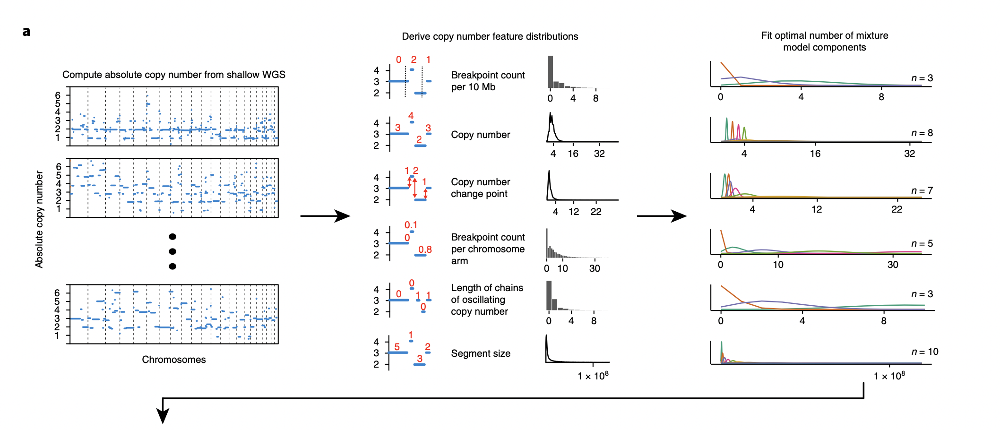

```{r setup, include=FALSE}
knitr::opts_chunk$set(echo = TRUE)
```

The goal of the "CN-Signatures Utils" package is to be a swiss army knife in analyzing shallow/low-pass whole genome sequencing data. Specifically, the focus of the package is to be on functions to re-structure data, with a focus on effective visualization and analysis of CN signatures. 

The flowchart represents the steps involved in the analysis of shallow/low-pass whole genome sequencing data for copy number signatures. In this vignette, we specifically focus on the relative and absolute copy-number calling. Generally in such an analysis, `QDNAseq` has been commonly used in calling relative copy-numbers. The output generated by `QDNAseq` is in the form of an S4 object.

```{r, eval = FALSE, message = FALSE, warning = FALSE}
# Libraries
library(QDNAseq)
library(tidyverse)
library(rascal)
library(data.table)
# Reading in test data
qdnaseq_output <- readRDS("~/projects/vignettes/30kb_rCN_comCNVfilt.rds")
# QDNAseq object
dplyr::glimpse(qdnaseq_output)
```

Packages such as `QDNAseq` are used for summing the number of reads that align within genomic windows or bins, typically 30kb in size, and correcting for GC-content and mappability. Thus, these packages output copy number values that are relative to the average copy number within the sample for the GC and
mappability of each bin. Relative copy numbers are smoothed and segmented to determine genomic regions with gains or losses.

However, for inferring copy number signatures, relative copy numbers must be converted to absolute copy numbers. Relative copy number profiles can thus be fit to absolute copy numbers by evaluating various estimates of ploidy and cellularity, and selecting the best fit estimates. In the workflow native to the CN-Sigs utils package, the R package `rascal` is used to call absolute copy numbers.

The batch fitting script for `rascal` can be run on the command line to estimate tumour ploidies and cellularities for multiple samples. The function that performs this in the `rascal` package is `copy_number_for_sample.R`.

```{r, eval = FALSE}
Rscript fit_absolute_copy_numbers.R -i 30kb_rCN_comCNVfilt.rds -o 30kb_aCNsolutions.csv
```

`rascal` accepts either a RDS file containing a `QDNAseqCopyNumbers` object/ a dataframe/RDS file containing the following columns: 

- sample
- chromosome
- start
- end 
- segmented

The output format can be chosen by the user. In this case, running `rascal` outputs a .csv file of all the solutions found all the ploidy and cellularity solutions found for a particular sample. `rascal`'s workflow includes the mean absolute distance (MAD) (which is the default) or root mean square deviation (RMSD) to find the optimal ploidy and cellularity solutions.

## Calculate ACNs

The CalculateACNs function is extremely important, as it calculates the absolute copy numbers (ACNs) from the relative copy number profiles of one or more samples. In order to understand what this function does, it is important to begin by clarifying the inputs that the function expects.

The first argument expected by CalculateACNs, relative_segs, is a tab-separated values (TSV) file containing the relative segmented copy-numbers.

```{r, eval = FALSE, echo = FALSE}
rcn_segs <- "~/projects/vignettes/30kb_rCN_segs_comCNVfilt.tsv"

rcn_segs <- data.table::fread(file = rcn_segs, sep = '\t')
head(rcn_segs[ ,1:8])
```

The table above shows the feature (in the following format, chromosome:start-end), chromosome, start and end, followed by individual sample relative segmented copy-numbers (wide format data).

The second argument, acnmethod, is a string which represents the method by which ACNs are being calculated. It can be one of: 
- "maxvaf", 
- a character vector of the genes from which to pull VAFs, where genes are assumed to be in order of decreasing precedence, ex. c('TP53', 'KRAS', 'PTEN'),
- "mad"

The third argument, rascal_sols, is a CSV file of the calculated rascal solutions.

```{r, eval = FALSE}
solutions <- "~/projects/vignettes/30kb_comCNVfilt_rascal_solutions.csv"

solutions <- data.table::fread(file = solutions, sep = ',')
head(solutions)
```

The table above has the ploidy, cellularity and distance columns. The distance is calculated using a rascal helper function (based on mean absolute difference (MAD) or root mean square different (RMSD)).

The fourth argument for the CalculateACNs, variants, is the variants table, which is a comma-separated values (CSV) file containing long-format data. The data appear as follows:

```{r, eval = FALSE}
variants_path <- "~/projects/vignettes/p53abn_endometrial_variants_customoutput_20230413.csv"

variants <- data.table::fread(file = variants_path, sep = ',')

#rename gene_symbol to gene_name in order to meet the input requirements
variants <- variants %>% dplyr::rename(gene_name = gene_symbol)
head(variants[, 1:10])
```

The variants table is a dataframe of the variants including variant allele frequencies per gene and per sample. The following are the requirements for the variants table when using VAFs from targeted panel sequencing or some other technology: 

- The variants must must be in a datatable/dataframe
- The required columns are as follows: sample_id, chromosome, start, end, gene_name, ref, alt, vaf (with these exact names, but in any order)
- Each row of said table must correspond to a unique variant
- Each variant must have an associated variant allele frequency
- Each row must also be associated with a specific sample

Note that this example variants table has more variant information than is absolutely necessary for the input.

The fifth argument is relative_cns; a TSV of the relative copy-numbers. It is mandatory if 'addplots' param (a parameter that allows plots to be returned alongisde the ACNs) is set to true.

```{r, eval = FALSE}
rel_cns <- "~/projects/vignettes/30kb_rCN_cns_comCNVfilt.tsv"

rel_cns <- data.table::fread(file = rel_cns, sep = '\t')
head(rel_cns[ ,1:8])
```

The table above shows the feature (in the following format, chromosome:start-end), chromosome, start and end, followed by individual sample relative copy-numbers (wide format data).

Please note, the first argument (relative_segs) and fifth argument (relative_cns) seem very similar in terms of what the tables look like, but are quite different; relative_segs is a TSV containing the relative segmented copy-numbers, whereas relative_cns is a TSV containing the relative copy-numbers.

In addition to the five parameters, there are three optional parameters;

- addplots, Logical. This indicates whether or not plots should be returned alongside the ACNs.
- acn_save_path, String. The output path where the result will be saved. An absolute path is recommended for this, ex. '/Users/newuser/Documents/output.rds'
- return_sols, Logical. Returns the selected rascal solution.

Lastly, here is what the output of CalculateACNs appears to be;

```{r, eval = FALSE}
# Example of output file
output <- readRDS("~/projects/vignettes/30kb_aCN_rascal_segments_comCNVfilt.rds")
head(output[[1]])
```

CalculateACNs returns an R Data Serialization (RDS) file. This output file is a list of named dataframes, where each dataframe corresponds to a different sample where an Absolute Copy Number profile was successfully found. Optionally a second list of plot objects (ggplot); one for each sample where a profile was found.

## What Features is this Workflow missing?

This vignette contains the initial workflow for absolute copy number calling that is an important part of the pipeline in inferring copy number signatures. Some features missing in this workflow that would be useful additions to the package are the following: 

Functions to evaluate the quality of the samples are likely to be a crucial part of this package at all stages of copy number and signature calling. In particular this includes: 

- A function to output metrics to evaluate the quality of the `QDNASeq` relative copy numbers, as well as the `rascal` absolute copy numbers. It is particularly important to have a designated metric assigned to evaluating the `rascal` copy number calls of multiple samples. While `rascal`'s workflow includes the mean absolute distance (MAD) or root mean square deviation (RMSD) to find the optimal ploidy and cellularity solutions, the `rascal` authors further recommend manually clicking through segment copy number plots of multiple samples to evaluate the quality of th calls manually. This is a tedious process that should be automated for better usability of the copy number calling pipeline. Some metrics and additions to think about are the following:
- [Metrics used to compare QDNAseq and WisecondorX](https://academic.oup.com/nar/article/47/4/1605/5253050?login=true). In particular, the observed median segment variance (MSVo) seems interesting but there are other statistics in this paper that should likely be implemented in the package such as the Lilliefors normality statistic. The MVSo, a sample-wise measure for noise, is defined as the median of a set of variances, where each variance corresponds to the variance of a segment. This metric is inversely proportional to read depth and selected bin size, and reflects the noise as a sample-wide measure.
- [The Copy number profile abnormality score](https://static-content.springer.com/esm/art%3A10.1186%2Fs13073-020-00735-4/MediaObjects/13073_2020_735_MOESM2_ESM.docx). The CPA score is designed to distinguish abnormal from healthy copy number profiles and contains a penalty term for shorter segments, which are exclusively observed in bad quality or truly highly aberrant samples.

Some ideas of features to implement are the following:

1. Function to output a table of these statistics per sample. We should test out this statistics on our data by looking at how well they capture what we see in the manual evaluations for some of the samples, and make a vignette of a recommended workflow to use for maximum usability of the package. 

2. Plots which capture the distribution of these statistics for the entire sample set such as a line plot or histogram. 

3. It would be interesting to capture the "outliers" relative to the other samples (an apples-to-apples comparison of tumour samples to the others). Thus a function that could automate this and output the copy number profile plots for just a couple of these samples with abberant copy number profiles would be very useful.

## General Package Functionalities to work on

1. Re-factoring and cleaning code
2. Documentation 
3. Flexible QDNASeq S4 object
4. Consistent input and output formats
5. Unit tests

## What comes next in inferring CN-signatures?

The following downstream analyses follow after the absolute copy number calling step in inferring copy number signatures. The package currently contains functions for these which need to be modified next:

1. Inferring the distributions of absolute copy number feature distributions - the breakpoint count per 10Mb, the copy number of the segments, the difference in copy number between adjacent segments, the breakpoint count per chromosome arm, the lengths of oscillating copy number segment chains and the size of segments. A mixture model is then fit to these six distributions, This directly corresponds to the figure below [(Macintyre et al., 2018)](https://www.nature.com/articles/s41588-018-0179-8.pdf).


```{r, echo = FALSE}

```

2. Apply non-megative matrix factorization to visualize the tumor-by-signature matrix, the signature-by-component matrix and copy numbers by the copy number features which is an important end-result of this package. Ideally, we want to add an intelligent plotting function that is capable of plotting these visualizations side-by-side with annotations for metadata, etc. 

```{r, echo = FALSE}
knitr::include_graphics("images/papf.png")
```

(from [(Macintyre et al., 2018)](https://www.nature.com/articles/s41588-018-0179-8.pdf))

### Ideal Package Output

```{r, echo = FALSE}

```

**Note:** Sample quality evaluation at this stage is a key need this package aims to meet. Currently there are no well established methods to evaluate the quality of these signature calls.
