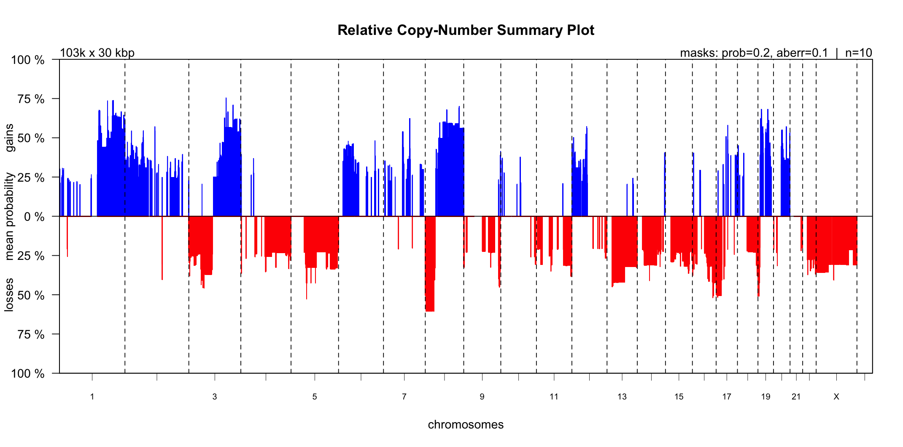
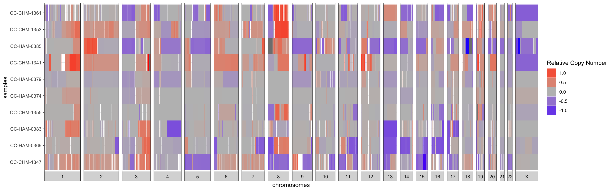
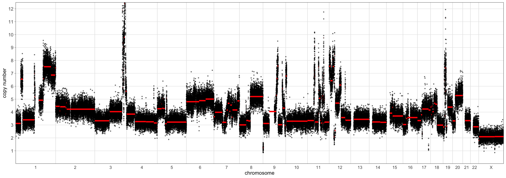
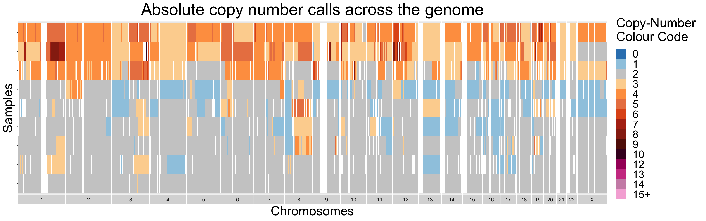

```{r, include = FALSE}
knitr::opts_chunk$set(
  collapse = TRUE,
  comment = "#>"
)
```

***

## I - Introduction

Broadly, this vignette seeks to demonstrate how a user could answer the following three questions using __utanos__:

  * In my dataset, where do copy-number (CN) gains and losses co-occur? 
  * To what extent do these aberrations co-occur across individual samples?
  * How can this be done at the relative-CN vs absolute-CN scales?

__Utanos__ provides two options by which to find answers to these questions.  
1 - using plots/diagrams to visualize the differences, or 2 - by manually examining informative, well-formatted tables.

<br>
**Exclusions:** This vignette does not cover data filtration or setting masks in the QDNAseq object in any detail. The vignette titled "Sample Filtering and Quality Evaluation" covers the filtration and QC steps. 
<br><br>

As an example dataset we will again use the samples found in the *utanosmodellingdata* repository found [here](https://github.com/Huntsmanlab/utanosmodellingdata). If not already done, clone that repo to somewhere convenient such as a common 'repos' folder on your machine and read in the example data. It is human endometrial carcinoma sWGS data aligned to hg19. The associated publication (Jamieson, 2024) was published in CCR and can be found [here](https://doi.org/10.1158/1078-0432.CCR-23-3689).

```{r setup, eval = FALSE}
> library(utanos)
> library(QDNAseq)
> library(magrittr)
> rcn.obj <- readRDS("~/repos/utanosmodellingdata/sample_copynumber_data/sample_rcn_data.rds")
```

```{r, eval = FALSE}
> rcn.obj
QDNAseqCopyNumbers (storageMode: lockedEnvironment)
assayData: 103199 features, 10 samples 
  element names: copynumber, segmented 
protocolData: none
phenoData
  sampleNames: CC-CHM-1341 CC-CHM-1347 ... CC-HAM-0385 (10 total)
  varLabels: name total.reads ... loess.family (6 total)
  varMetadata: labelDescription
featureData
  featureNames: 1:1-30000 1:30001-60000 ... Y:59370001-59373566 (103199 total)
  fvarLabels: chromosome start ... comCNV.mask (11 total)
  fvarMetadata: labelDescription
experimentData: use 'experimentData(object)'
Annotation: 

```

## II - Call gains and losses on relative copy-number data

The callBins function from the QDNAseq package can be run on segmented copy number data to determine chromosomal aberrations. This function adds gain/loss probability slots to the input S4 object. Under the hood it makes use of the CGHcall R package.
Please refer to those packages for further algorithmic details.

Here is an example after first filtering as outlined in the previous vignette.

```{r, eval = FALSE}
> rcn.obj <- FilterCNs(cnobj = rcn.obj, genome = "hg19", 
                       maskcomCNVs = TRUE, removebins = TRUE)
> rcn.obj <- callBins(rcn.obj)
```

Notes:  

* Depending on dataset size the `callBins()` function can take a while

## III - Plotting

### III.1 - CN-Summary Plot

The CGHbase R-package provides an excellent plot showing the gain and loss probability across multiple samples. __Utanos__ contains a modified version of this plotting function and it can be generated like so...

```{r, eval = FALSE}
> SummaryCNPlot(rcn.obj, maskaberr = 0.1, maskprob = 0.2)
```

```{r, out.width = '100%', echo = FALSE}

```

Notes:  

  * The 'maskaberr' parameter - Default Value: 0.1. This parameter filters out all gains and losses across samples where the CN-change (the aberration itself) lies between this value and zero.
  * The 'maskprob' parameter - Default Value: 0.2. This parameter filters out all the gain/loss probabilities below this value. The callBins function assigns a probability of gain/loss to each bin of each sample. This is especially useful when analyzing noisy samples.

These parameters are quite similar but both are available because it allows users to mask low probability gain/loss regions without taking into account how large the gain/loss was.

### III.2 - Relative-CN Diversity Plot

Alternatively, the relative copy-number changes can be visualized sample-by-sample as a heatmap with red signifying a relative gain and blue a loss. For just a few samples, row-wise clustering doesn't have too much of an effect on the plot, but for larger cohorts setting the `cluster` parameter to `TRUE` can really help to highlight trends in the data. This is a simple hierarchical clustering. 

```{r, eval = FALSE}
> rcn.plot <- RCNDiversityPlot(rcn.obj, Xchr = TRUE, cluster = TRUE)
> rcn.plot
```

```{r, out.width = '100%', echo = FALSE}

```


## IV - Table Output

An alternative way to understand the data displayed in the plot for section III.1 is in tabular format. This allows for custom filtering, juxtaposing actual numbers, and creating dataset-specific plots. The `MakeSummaryTable()` function can be used to generate tables of the copy-number gains and losses.  
If desired, the user can also generate a second table containing just the peaks by setting `find_peaks = TRUE`. The threshold parameters outlined in the below code section will apply to both the generated summary CN aberrations table and the peaks table. Peaks in the CN probability data are identified using the `gsignal::findpeaks` function. Peaks are simply defined as local maxima. This function itself is a port-over of its namesake function in the Octave package 'signal'.  
Alongside the copy-number gains and losses reported in these table is a column for the genes contained in the region. This is a convenience for checking whether or not some gene-of-interest is contained within a copy-number aberration. Just the human and mouse reference genomes are supported at this point (Ex. 'mm10').  
The `MakeSummaryTable()` function returns a list with either 1 or 2 tables (type: tibble).  
<br>
These tables can be easily saved as csvs, tsvs, or in your favourite tabular format for perusal in a different user-friendly application such as excel.

```{r, eval = FALSE}
> library(gsignal)

# Probability of gain or loss threshold - i.e. declare the minimum mean probability of loss or gain across samples
# Expl. For region Chr1:2850001-2865000, and probabilities of loss for 10 samples of:
# 0.814 0 0 0 0 0.125 0.975 0 0 0
# The mean probability of loss would be 0.1914
> prob_loss <- 0.2
> prob_gain <- 0.2

# Log space mean relative copy number thresholds
# To keep things consistent with the plot from the last section, lets use 0.1
> low_threshold <- -0.1
> high_threshold <- 0.1

# Presence threshold - i.e. In what minimum proportion of samples does the gain or loss need to be present?
> proportion_threshold <- 0.2

# Run command
> output <- MakeSummaryTable(rcn.obj, 
                             low_threshold, high_threshold, 
                             prob_loss, prob_gain, 
                             proportion_threshold,
                             find_peaks = TRUE)
> output$summary_table %>% head(5)
# A tibble: 5 × 16
  chromosome    start      end mean_copy_number gain_probability loss_probability gain_count
  <chr>         <int>    <int>            <dbl>            <dbl>            <dbl>      <dbl>
1 1           8910001  9060000            0.157            0.244           0.0049          5
2 1           9600001 10230000            0.139            0.252           0.0038          6
3 1          10620001 10740000            0.119            0.222           0.0062          5
4 1          15420001 15630000            0.148            0.292           0.106           3
5 1          15960001 16080000            0.155            0.302           0.106           3
# ℹ 9 more variables: loss_count <dbl>, gain_proportion <dbl>, loss_proportion <dbl>,
#   gain_samples <chr>, loss_samples <chr>, bin_count <int>, sum_of_bin_lengths <dbl>,
#   coordinates <chr>, features_in_region <chr>
```


## V - Scaling to the Absolute Copy-Number Space

### V.1 - Performing the scaling

The Relative CNs space can be useful for identifying trends of relative gains and losses across samples in an experiment. However, absolute copy-numbers (aCNs) can be even more useful as they indicate ploidy and place real numbers on genomic features such as high-amplification events. __Utanos__ makes use of the [rascal](https://github.com/crukci-bioinformatics/rascal) package to scale from the relative to absolute space.  
Here, we will briefly detail the options and workflow, but for a more thorough understanding we recommend the user read through the rascal vignette. 

There are three major options for scaling depending on the data available:

 1. __*mad/rmsd*__: Without any other data/metadata, just the copy-numbers, this is the best option. Different ploidy/cellularity combinations are assumed, the relative CNs are scaled to absolute, and then the difference of each value to the nearest whole-number is calculated. The difference is quantified as either the mean absolute deviation (mad) or root mean squared error (rmsq). Finally, a grid search is performed to determine the local minima and these are reported as the solution(s). If several 'solutions' are nearly equivalent then rascal returns several, otherwise a single cellularity-ploidy-mad/rmsq distance combo is returned. Many more options for tuning are available in the package and will not be discussed here.
 2. __*vafs*__: In the case of having variant allele frequencies (vafs) for each sample, these can be used to identify the nearest ploidy-cellularity combination (as described in 1). There are two options under this umbrella. One will assume the maximum discovered VAF for the sample is an appropriate representation for the tumour fraction. Below is a equation describing the relationship used to select the optimal solution from the grid search. For more details see the vignette in the [rascal github repo](https://github.com/crukci-bioinformatics/rascal).
 
  $$tumour fraction_i \ = \ \frac{a_i c}{a_i c + 2(1-c)}$$
 
  $$ c = cellularity \text{, } a_i = \text{copy-number at locus i}$$
 
  The other will use the vafs of only certain genes the user identifies. For example if the user expects 'PTEN' vafs to be suggestive of the tumour fraction they can choose to scale using just those vafs.
 
 3. __*Known ploidies*__: In the case of knowing the sample ploidies via some other method (ex. FISH), this option will simply scale the relative copy-numbers for each sample to absolute given those ploidies.
 
The __utanos__ function documentation contains specifics on expected formatting for each of these options. 

__Utanos__ splits aCN scaling into two parts. First, the likeliest solutions (ploidy/cellularity/distance) are calculated using rascal, and then second the values are scaled and a new CN-object is made. 

#### V.1.1 - Performing the scaling (part 1)

---

To find the optimal ploidy and cellularity, use the `FindRascalSolutions()` function. \
Only the first argument is mandatory, the rest are optional.

Arguments:
1. `cnobj` - The relative copy-number object we've been using throughout all these vignettes.
2. `min_ploidy` & `max_ploidy` - Determines the range of ploidies to search from.
3. `ploidy_step` - The stepwise increment of ploidies along the range.
4. `min_cellularity` & `max_cellularity` - Determines the range of cellularities to search from.
5. `cellularity_step` - The stepwise increment of cellularities along the range.
6. `distance_function` - The distance function to use, "MAD" (mean absolute difference) or "RMSD" (root mean square difference).
7. `distance_filter_scale_factor` - The distance threshold above which solutions will be discarded as a multiple of the solution with the smallest distance.
8. `max_proportion_zero` - The maximum proportion of fitted absolute copy number values in the zero copy number state.
9. `in_proportion_close_to_whole_number` - The minimum proportion of fitted absolute copy number values sufficiently close to a whole number.
10. `max_distance_from_whole_number` - The maximum distance from a whole number that a fitted absolute copy number can be to be considered sufficiently close.
11. `solution_proximity_threshold` - How close two solutions can be before one will be filtered; reduces the number of best fit solutions where there are many minima in close proximity.
12. `keep_all` - `TRUE` to return all solutions but with additional `best_fit` column to indicate which are the local minima that are acceptable solutions (may be useful to avoid computing the distance grid twice).

```{r, eval = FALSE}
> solutions <- FindRascalSolutions(cnobj)
```

---

#### V.1.2 - Performing the scaling (part 2)

To scale the samples use the `CalculateACNs()` function.  
The first three arguments are mandatory, the rest are optional depending on context.  
The first 4 arguments would benefit from some elaboration, so those will be described, and then we provide some examples for using this function.  

Arguments:

1. `cnobj` - The relative copy-number object we've been using throughout all these vignettes.
2. `acnmethod` - The method for scaling. Expects a string. It can be one of: 
    - “maxvaf”: Chooses the solution that aligns with the maximum detected VAF. We assume that to be suggestive of the cellularity according to the formula above
    - A character vector of the genes from which to pull VAFs, where genes are assumed to be in order of decreasing precedence, ex. c(‘TP53’, ‘KRAS’, ‘PTEN’), 
    - “mad”: Chooses the solution with the lowest MAD or RMSD score; in the case of a tie goes with the lower ploidy solution.
    - A dataframe of known ploidies. Scales each sample to aCN space using these plodies. Expects a column with `sample_id` - matching those in the `rcn.obj`, and `ploidy` - a numeric value.
3. `rascal_sols` - The third argument expects a TSV file or data.frame of the calculated rascal solutions. See part 1 for details on creation.

Example solutions table:
```{r, eval = FALSE}
> solutions <- FindRascalSolutions(cnobj)
> head(solutions)
##         sample ploidy cellularity distance
## 1: CC-CHM-1341   3.34        0.85    0.166
## 2: CC-CHM-1341   1.34        0.46    0.166
## 3: CC-CHM-1341   3.33        0.90    0.166
## 4: CC-CHM-1341   2.34        0.60    0.166
## 5: CC-CHM-1341   2.35        0.52    0.174
## 6: CC-CHM-1341   4.34        1.00    0.176
```

4. `variants` - The fourth argument for CalculateACNs, is an optional argument. In the event of having variants data this parameter expects a table or file path to a comma-separated values (CSV) file containing long-format data.  
   Requirements for the variants table when using VAFs from targeted panel sequencing or some other technology:
    - The variants must must be in a datatable/dataframe
    - The required columns are: `sample_id`, `chromosome`, `start`, `end`, `gene_name`, `ref`, `alt`, `vaf` (with these exact names, but in any order)
    - Each row of said table must correspond to a unique variant
    - Each variant must have an associated variant allele frequency
    - Each row must also be associated with a specific sample, `sample_id` must match  
    
Example variants data table:
```{r, eval = FALSE}
> variants_path <- "~/some_path/variants.csv"
> variants <- data.table::fread(file = variants_path, sep = ',')
> variants <- variants %>% dplyr::rename(gene_name = gene_symbol)
> head(variants[, 1:10])
##      sample_id chromosome     start       end ref alt gene_name
## 1: CC-CHM-1341          3  30691871  30691872  GA   G    TGFBR2
## 2: CC-CHM-1341          3 142274739 142274740  AT   A       ATR
## 3: CC-CHM-1341          7 151945071 151945071   G  GT     KMT2C
## 4: CC-CHM-1341         10  90771767  90771767   G   A       FAS
## 5: CC-CHM-1341         16    343635    343635   C   T     AXIN1
## 6: CC-CHM-1341         17   7577556   7577556   C   T      TP53
##                       consequence estimated_impact  vafs
## 1:             frameshift_variant             HIGH 0.201
## 2:             frameshift_variant             HIGH 0.196
## 3: stop_gained,frameshift_variant             HIGH 0.212
## 4:               missense_variant         MODERATE 0.301
## 5:               missense_variant         MODERATE 0.226
## 6:               missense_variant         MODERATE 0.720
```

Note: this example table has more information than is necessary. There are extraneous columns.

<br>

Examples:  

A. Scaling using the solution with the best (lowest) distance:
```{r, eval = FALSE}
> outputs <- CalculateACNs(rcn.obj, 
                           acn.method = 'mad', 
                           rascal_sols = solutions)
```

B. Scaling using the 'maxvaf' option and providing some variant allele frequencies 
```{r, eval = FALSE}
> outputs <- CalculateACNs(rcn.obj, 
                           acn.method = 'maxvaf', 
                           rascal_sols = solutions, 
                           variants = variants, 
                           return_sols = TRUE, 
                           return_S4 = TRUE)
Warning message:
In ReplaceQDNAseqAssaySlots(cnobj, output[["acns"]], output[["acns_segs"]]) :
  Not all samples had ACN solutions.
    These samples are excluded from the returned acn object.
    The probability of loss/gain values in the returned acn object were calculated using the relative CNs object.
> names(outputs)
[1] "rascal_solutions" "acn.obj"
> outputs$rascal_solutions %>% head(5)
    sample_id ploidy cellularity tumour_fraction   vaf
1 CC-CHM-1341   1.34        0.46           0.365  0.72
2 CC-CHM-1347   3.46        0.32           0.592 0.874
3 CC-CHM-1355      2        0.83           0.828 0.395
4 CC-CHM-1361      2        0.72           0.719 0.313
5 CC-HAM-0369   1.94           1               1 0.872
```

C. Scaling by prioritizing variants from certain genes.
```{r, eval = FALSE}
> outputs <- CalculateACNs(rcn.obj, 
                           acnmethod = c("TP53", "KRAS", "PTEN"), 
                           rascal_sols = solutions, 
                           variants = variants, 
                           return_sols = TRUE, 
                           return_S4 = TRUE)
Warning message:
In ReplaceQDNAseqAssaySlots(cnobj, output[["acns"]], output[["acns_segs"]]) :
  Not all samples had ACN solutions.
    These samples are excluded from the returned acn object.
    The probability of loss/gain values in the returned acn object were calculated using the relative CNs object.
```

Note: The warning message for C provides a useful message to users in case an ACN solution for some samples was not found by rascal. 

### V.2 - Plotting

#### V.2.1 - Copy-Number Segment Plots

These scaled copy-numbers, absolute copy-numbers (aCNs), can be visualized using the same plotting function mentioned in vignette 1. Let's briefly compare the aCNs generated using the maxvaf solution compared to the 'mad' solution.

```{r, eval = FALSE}
> maxvaf_outputs <- CalculateACNs(rcn.obj, 
                                  acn.method = 'maxvaf', 
                                  rascal_sols = solutions, 
                                  variants = variants, 
                                  return_S4 = TRUE)
> mad_outputs <- CalculateACNs(rcn.obj, 
                               acnmethod = 'mad', 
                               rascal_sols = solutions, 
                               return_S4 = TRUE)
> CNSegmentsPlot(maxvaf_outputs$acn.obj, 
                 sample = "CC-CHM-1341", 
                 min_copy_number = 0, 
                 max_copy_number = 12.5, 
                 copy_number_breaks = c(1:12))
```

```{r, out.width = '100%', echo = FALSE}
knitr::include_graphics("images/cndiversity_vignette_03.png")
```

```{r, eval = FALSE}
> CNSegmentsPlot(mad_outputs$acn.obj, 
                 sample = "CC-CHM-1341", 
                 min_copy_number = 0, 
                 max_copy_number = 12.5, 
                 copy_number_breaks = c(1:12))
```

```{r, out.width = '100%', echo = FALSE}

```

The scaling using the 'mad' set the sample ploidy to around 4 whereas the 'maxvaf' option instead preferred a ploidy of 2.  

#### V.2.2 - Copy-Number Diversity Plots

Finally, similarly to section III.2, samples can be visualized all together as a heatmap. Using this strategy, sample-to-sample similarities and differences are easily differentiable. For datasets with larger numbers of samples, it is recommended to order the samples in some informative manner. This is done by default in the `ACNDiversityPlot` function. The ordering is found by performing hierarchical clustering on the passed in copy-number segments. 

By design, the `ACNDiversityPlot` function expects data in long-format. This is to encourage users to think about the bin-size they would like to plot. For example, when plotting a genome 3 billion base pairs long bins 30kb across will barely be visible to the eye. A bin this size on a 7-inch plot would make up roughly 7e-05 of the width. So even if there is a one-bin amplification, it will not be visible on the heatmap. However, it will matter a lot the the plotting software. Drawing rectangles for this many minuscule bins potentially across many samples will be take a very long time!  
TL;DR there is no real point in plotting tiny bins for this plot-type.  
Instead, re-shape the data to a comfortable bin-size for plotting to improve speed. We have found 1e06 to 2e06 to be reasonably quick for up to several hundred samples.  
If the user is interested in finding tiny amplification events, filtering and examining the tabular outputs would be a much better option (ex. `outputs$acn_segment_tables`). 

```{r, eval = FALSE}
> outputs <- CalculateACNs(rcn.obj, 
                           acnmethod = 'mad', 
                           rascal_sols = solutions)
> long_segs <- SegmentsToCopyNumber(outputs$acn_segment_tables, 
                                    1000000, 
                                    genome = 'hg19', 
                                    Xincluded = TRUE)
> colnames(long_segs) <- c("chromosome", "start", "end", "state", "sample_id")
> ACNDiversityPlot(long_segments = long_segs)
```

```{r, out.width = '100%', echo = FALSE}

```


