```{r, include = FALSE}
knitr::opts_chunk$set(
  collapse = TRUE,
  comment = "#>"
)
```

---

### Pre-amble

---

This vignette demonstrates how to use copy-number (CN) abnormalities data, which could represent the imprints of distinct mutational processes, to either build new CN-Signatures or determine which existing signatures are present in a dataset. This workflow is based on one described in the methods section of a [paper published](https://www.nature.com/articles/s41588-018-0179-8) in 2018 [@macintyre2018copy]. 

Most of the published literature thus far has focused on CN-Signatures from absolute copy-number data. That is to say data where the sample ploidy is known. However, CN-Signatures can be extracted from both relative and absolute CN data, and so both cases will be covered here.

First, this vignette will cover finding signature exposures in a new dataset using existing signatures (section III). Second, the creation of new signatures will be covered (section IV). In either case, to begin, a set of samples with segmented copy-number profiles are needed.
These profiles should be either formatted as a list of named dataframes or exist within a QDNAseq object.  

---

### I - Input data

---

In earlier vignettes it sufficed to use just a few samples to demonstrate the usage of utanos functions. However, in order to generate new cn-signatures, considerably more data is needed. Therefore, to demonstrate both signature exposure calling and the creation of new signatures, the Britroc HGSOC (High-Grade Serous Ovarian Carcinoma) cohort will be used [@macintyre2018copy]. The segmented copy-number data can be found [here](https://bitbucket.org/britroc/cnsignatures/src/master/manuscript_Rmarkdown/data/) in the paper's bitbucket repository.

So step one, download said data/clone the repo, and read in the absolute copy-numbers:  
```{r setup, eval=FALSE}
> library(utanos)
> library(dplyr)
> acn.obj <- readRDS("~/repos/cnsignatures/manuscript_Rmarkdown/data/britroc_absolute_copynumber.rds")
> acn.obj
QDNAseqCopyNumbers (storageMode: lockedEnvironment)
assayData: 103199 features, 280 samples 
  element names: copynumber, segmented 
protocolData: none
phenoData
  sampleNames: IM_100 IM_101 ... JBLAB-4282 (280 total)
  varLabels: name total.reads ... mapTP53cn (10 total)
  varMetadata: labelDescription
featureData
  featureNames: 1:1-30000 1:30001-60000 ... Y:59370001-59373566 (103199 total)
  fvarLabels: chromosome start ... use (9 total)
  fvarMetadata: labelDescription
experimentData: use 'experimentData(object)'
Annotation:  
```

For this vignette we will use just the higher-quality samples (2 and 3 star in the context of that paper).
A list is available in utanosmodellingdata.

```{r, eval=FALSE}
britroc_samples_subset <- data.table::fread("~/repos/utanosmodellingdata/sample_sets/brit117_samples.csv")
acn.obj <- acn.obj[,britroc_samples_subset$x]
```

---

### II - Extract CN-features 

---

Step 2: extract copy number features using either the `ExtractCopyNumberFeatures()` or `ExtractRelativeCopyNumberFeatures()` function. To model copy-number aberrations in the genome, find trends and commonalities (what we will call signatures henceforth), specific features within the dataset are pulled out and modeled separately.

Standard features:  

1. Absolute copy-numbers at each genomic bin  (copynumbers)  
2. The magnitude of each copy number change (changepoints)  
3. The genomic length (in bp) of each segment  (segsizes)  
4. The number of breakpoints per chromosome arm  (brchrmarm)  
5. The number of breakpoints per 10 megabases  (bp10MB)  
6. The genomic length (in bp) of oscillating copy number regions  (osCNs)  

Optional features:

7. Minimum number of chromosomes (a count) needed to account for 50% of CN changes in a sample (nc50)  
8. Distance in base pairs of each breakpoint to the centromere (cdist)  

Both of the two CN-Signature sets included in utanosmodellingdata (from p53abn endometrial and HGSOC) use the standard features. For a few hundred samples, this function should run within a few minutes.

```{r, eval=FALSE}
cn_features <- ExtractCopyNumberFeatures(acn.obj, 
                                         genome = "hg19", 
                                         extra_features = FALSE)
```

---

### III - Determine CN-signature exposures

---

The HGSOC CN-Signatures included in the utanosmodellingdata repository were created using 91 samples (the highest quality ones). To find exposures for the remaining samples in the group, subset the original object by those samples not used for signature creation, and calculate exposures.  

The `CallSignatureExposures()` function in utanos runs several computational steps in the appropriate order for convenience. A user can run each of these separately should they want. For details see the docs for `ExtractCopyNumberFeatures()`/`ExtractRelativeCopyNumberFeatures`, `GenerateSampleByComponentMatrix()`, and `QuantifySignatures()`. 

```{r, eval=FALSE}
hgsoc_sigs <- readRDS(file = "~/repos/utanosmodellingdata/signatures/30kb_ovarian/component_by_signature_britroc_aCNs.rds")
acn.obj.subset <- acn.obj[,!colnames(acn.obj) %in% colnames(hgsoc_sigs@consensus)]
sigexposures <- CallSignatureExposures(copy_numbers_input = acn.obj.subset, 
                                       component_models = "~/repos/utanosmodellingdata/component_models/30kb_ovarian/component_models_britroc_aCNs.rds", 
                                       signatures = "~/repos/utanosmodellingdata/signatures/30kb_ovarian/component_by_signature_britroc_aCNs.rds",
                                       refgenome = "hg19", 
                                       relativeCN_data = FALSE) 
```

The exposures can be visualized with the `SignatureExposuresPlot()` function like so: 
```{r, eval=FALSE}
ggp1 <- SignatureExposuresPlot(sigexposures)
ggp1$plot
```

```{r, out.width = '100%', echo = FALSE}
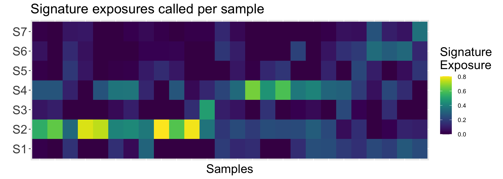
```

Alongside the plot, the `SignatureExposuresPlot()` function returns the sample ordering in the plot.
Given that these signatures are from the Macintyre et al. 2018 publication, let's re-order to match the signature order from the paper for easy comparison:
```{r, eval=FALSE}
reord_britroc <- as.integer(c(2,6,5,4,7,3,1))
ggp1 <- SignatureExposuresPlot(sigexposures[reord_britroc,])
ggp1$plot
```

```{r, out.width = '100%', echo = FALSE}
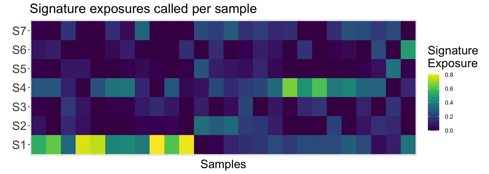
```

Interpreting this plot, it is clear the sample subset has higher exposures for signatures 1 and 4. These signatures correspond to poor overall survival + breakage-fusion bridge events and whole-genome duplication + PI3K/AKT signalling inactivation respectively. 

<br>

---

### IV - Create New CN-Signatures

---

Creating copy-number signatures anew involves a few more steps than directly determining exposures from existing signatures. This process can also be iterative where given some metrics, earlier steps are re-run with different parameters/inputs. This vignette will be using the Britroc cohort samples to demonstrate signature creation but will not be seeking to re-create the signatures found in that 2018 paper exactly. For an exact replication, the user to will need to set all parameters exactly as seen in the paper repository and run a few steps without the utanos wrappers.  
To reiterate, the modelling and signatures seen below will not match [@macintyre2018copy]. This is expected.

#### IV.1 - Modelling

First, the CN features discussed in section II are modeled using mixtures of gaussians or poissons with the help of the flexmix R-package [@flexmix2008]. Utanos provides a wrapper called `FitMixtureModels()`. Then, given these mixture models for each CN feature, all the samples used for modelling are compared to each component of each model and a sum-of-posterior probabilities matrix is calculated. The `GenerateSampleByComponentMatrix()` utanos function calculates these posteriors. In more detail: For each copy-number event for a feature in each sample, compute the posterior probability of belonging to a component for said feature. For each sample, sum these posterior event vectors to a sum-of-posterior probabilities vector. Combine the sum-of-posterior vectors into a patient-by-component sum-of-posterior probabilities matrix. 

Finally, given the patient-by-component sum-of-posterior probabilities matrix, matrix decomposition is run many times to decide on an optimal rank for the two output matrices (sample-by-signature matrix and a signature-by-component matrix). The optimal rank is the optimal number of signatures. The NMF R-package is leveraged for matrix decomposition using the `ChooseNumberSignatures()` function [@nmf2010].

Succinctly, the modelling stage involves...  

1. Fitting mixture components.  
2. Calculating a patient-by-component sum-of-posterior probabilities matrix.
3. Searching for the optimal number of signatures (interval of 3-12 is used by default), running NMF many times (ex. 1000x) with different random seeds for each signature number.

**Note on 2.** The returned sample_by_component matrix may have the components in a different order than the components in the component_models object. The components are not in increasing order in the component_models object.

**Note on 3.** Estimating the optimal number of signatures is quite computationally heavy. This function takes the longest to run of any in the utanos package. It might make sense to run this function and then get a snack!

```{r, eval=FALSE}
# Model using just the highest quality samples
acn.obj.high <- acn.obj[,colnames(acn.obj) %in% colnames(hgsoc_sigs@consensus)]
cnfeatures_high <- ExtractCopyNumberFeatures(acn.obj.high, 
                                             genome = "hg19", 
                                             extra_features = FALSE)

component_models <- FitMixtureModels(cnfeatures_high)
sample_by_component <- GenerateSampleByComponentMatrix(CN_features, component_models)

# The next function contains a method that MUST have NMF loaded, this is a known issue with the NMF package
library(NMF)
rank_estimate_outputs <- ChooseNumberSignatures(sample_by_component)
NMF::plot(rank_estimate_outputs$estrank, rank_estimate_outputs$randomized_estrank,
          what = c("cophenetic", "dispersion", "sparseness", "silhouette"),
          xname = "Observed", yname = "Randomised", main = "")

```

```{r, out.width = '80%', echo = FALSE}
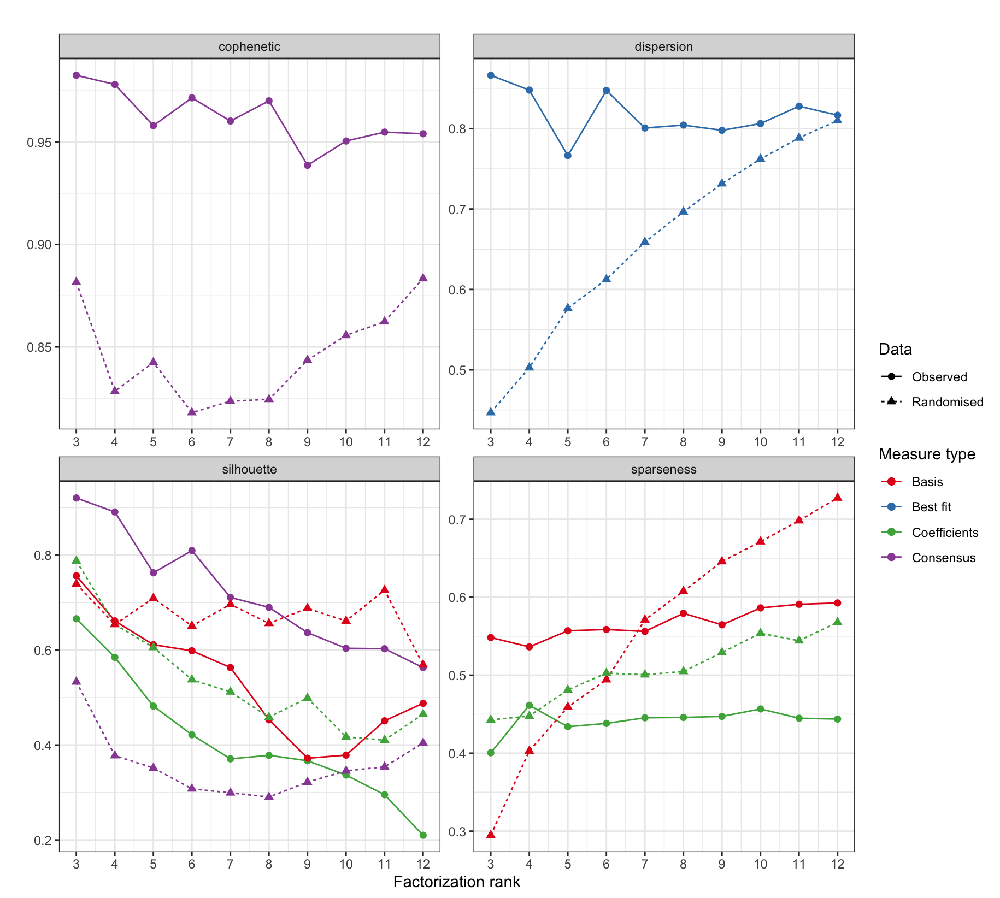
```

This dot and line plot contains several metrics from the NMF runs over possible ranks that aid in the selection of an optimal number of signatures.

Very brief heuristics for what to look for in the values of each metric:  
cophenetic: higher => better; after the trend begins increasing (after 2) choose the max value before it decreases again.  
dispersion: higher => better, measures the reproducibility  
silhouette: higher => better, measures consistency between clusters  
sparseness: higher => better, try to choose the maximum sparsity which can be achieved without that for the corresponding randomly permuted matrix exceeding it  

For a detailed discussions about each of these metrics consult the NMF package documentation or other sources online.

The utanos package defaults for the ChooseNumberSignatures() function include running NMF 100 times for each rank. This was to keep the default run-time manageable. Package users however are encouraged to experiment with more iterations and other run parameter values. The [@macintyre2018copy] paper for instance used 1000 iterations in estimating the rank (this and a few other parameters are the reason this plot differs from the one in the paper bitbucket repository).      

#### IV.2 - Evaluation

At this point it is a good idea to stop and examine the modelling done thus far.  
Some points to consider:

* If the metrics provided above for the input matrices do not appear to be outperforming the randomized matrices, you may wish to set more restrictive demands on what samples can be used as input data. The ability to detect copy number signatures absolutely depends on whether each pattern is sufficiently represented in the data, BUT, this signal can be obfuscated with lower quality samples that introduce noise. Finding a balance of quantity vs. quality is important. The largest number of high-quality samples possible used for signature creation (but no more) is ideal.
* By default utanos suggests using 6 CN features for modelling, however it may be desirable to use more/others. There are two more that can easily be used by setting the `extra_features` parameter of `ExtractCopyNumberFeatures()` to TRUE.
* Examine the sample-by-component matrix as a heatmap to see if there are major contributions from many different samples to each component. If the sample-by-component matrix does not indicate higher values for the posteriors for at least several components per sample it could be the case that the modelling is not appropriately capturing the heterogeneity in the data.
* Examine the consensus matrices (the average connectivity matrix across NMF runs) in heatmap form alongside the silhouette track (or others) to see how samples cluster together. Are there clear clusters emerging?

Visualize the sample-by-component matrix:
```{r, eval=FALSE}
NMF::aheatmap(sample_by_component, fontsize = 7, 
              Rowv=FALSE, Colv=FALSE, cexRow = 0, legend = FALSE,
              breaks=c(seq(0,199,2),500), 
              main="Component x Sample matrix")
```

```{r, out.width = '80%', echo = FALSE}
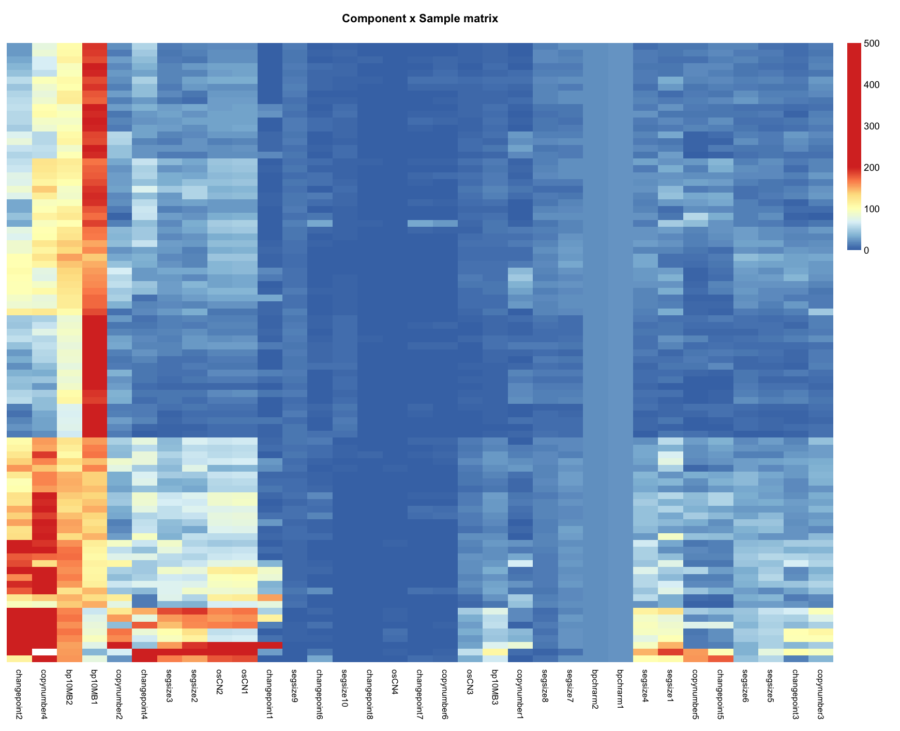
```

<br> 

And the consensus matrices across 4 ranks (5,6,7, and 8):
```{r, eval=FALSE}
NMF::consensusmap(rank_estimate$fit[c(3:6)], main='Consensus matrix - Cluster stability', treeheight = 0, labCol=NA, labRow=NA, tracks = c("silhouette:"))
```

```{r, out.width = '100%', echo = FALSE}
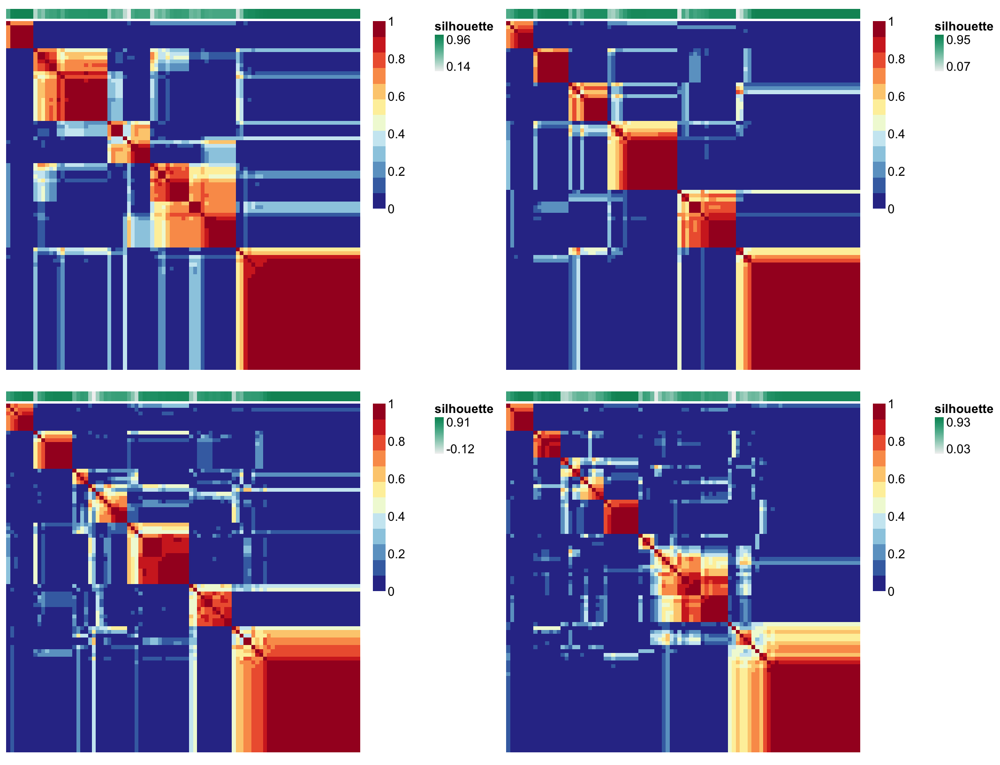
```

Note that the map corresponding to ranks 6 and 7 look pretty good, the same samples tend to cluster together across runs. Samples tend to be either dark red or dark blue rather than a lighter shade somewhere in between. For more details on connectivity/consensus matrices see the docs for `NMF::connectivity()`.  

If content with the modelling and a clear factorization rank (number of signatures) emerges, move on to the next section and create a signature set.

<br>

#### IV.3 - Create CN-Signatures

The `GenerateSignatures()` function is again running NMF many times (but not over multiple ranks) and therefore takes the second-longest to run of any function in the utanos package. It might make sense to start this function and then go get a snack!

```{r, eval=FALSE}
signatures <- GenerateSignatures(sample_by_component, 7)

# Usually worth stopping and saving the objects just created since re-running can take a while. 
# saveRDS(signatures, file = paste0("path_to_signatures/signatures_object.rds"))
# saveRDS(component_models, file = paste0("path_to_signatures/component_models_object.rds"))
```

The `GenerateSignatures()` function is very simple, wrapping just a single NMF call. It provides some default parameter values (ex. sets seed = 77777, and the nmf algorithm used to "brunet") but should the user which to test many different options use the `NMF::nmf()` function directly. 

<br>

As a final step to creating new signatures, visualize them using the NMF package's various heatmap options:  

* signature-by-component matrix as a heatmap (what we call a 'signature set' or 'signatures')
* sample-by-sample consensus matrix as a heatmap (same as above, just for one rank)
* sample-by-signature matrix as a heatmap (contribution of each sample to each signature)  

```{r, eval=FALSE}
basismap(signatures, Rowv = NA, main = "Signature x Component matrix")
consensusmap(signatures, main='Consensus matrix - Cluster stability', 
             treeheight = 0, labRow = NA, labCol = NA)
coefmap(signatures, Colv="consensus", tracks=c("basis:"), 
        main="Sample x Signature matrix", treeheight = 0)
```

```{r, out.width = '60%', echo = FALSE}
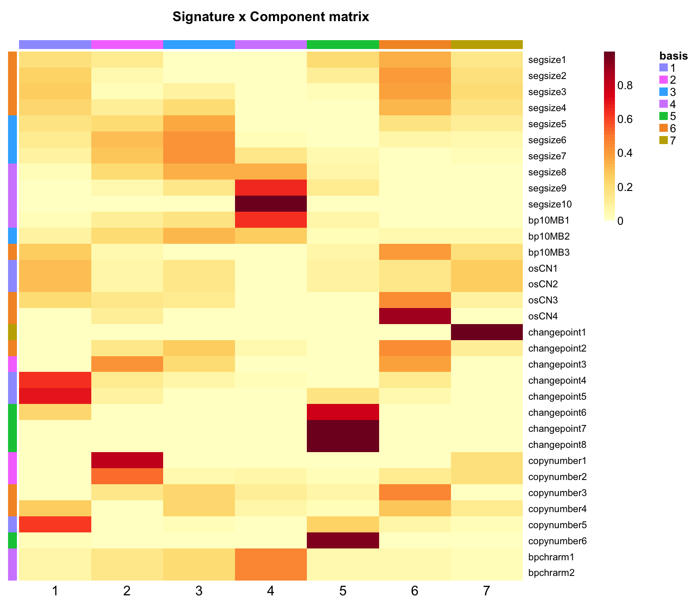
```

```{r, out.width = '60%', echo = FALSE}
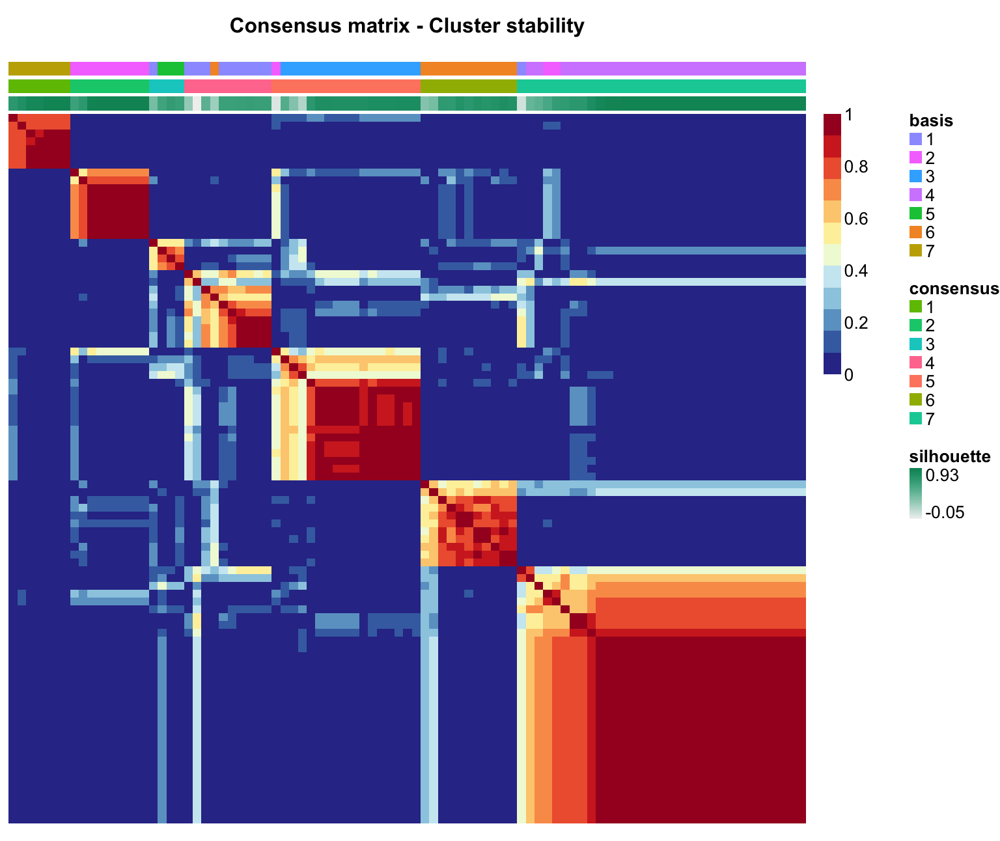
```

```{r, out.width = '60%', echo = FALSE}
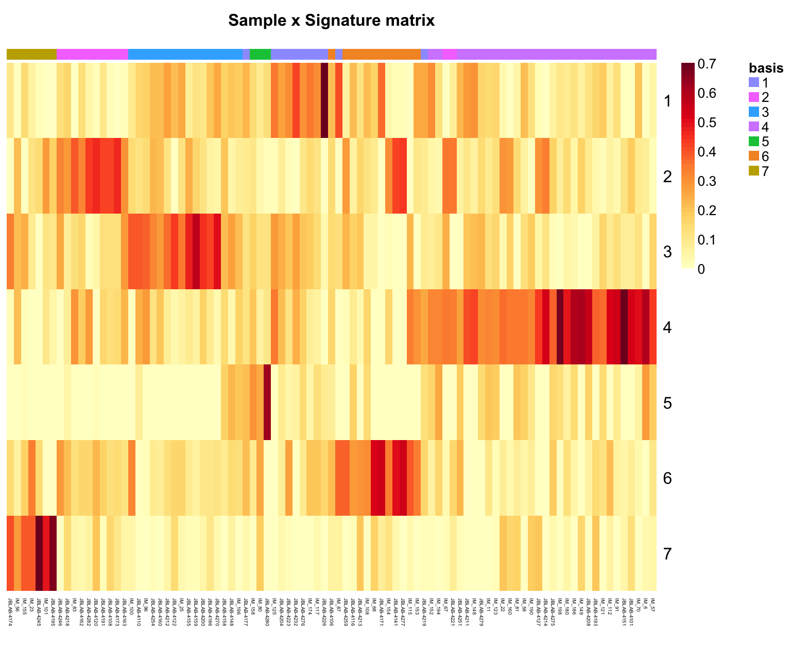
```


#### Section Note  
For the modelling section utanos provides a number of wrapping functions for flexmix and NMF for convenience. However, it's not unrealistic that the user may want more flexibility than these wrappers allow. In that case it is quite straightforward to grab the utanos source code from github out of these functions and run each step individually with more control.  

<br>
  
---

### V - Compare signature sets

---

Utanos includes 3 methods by which to compare between different signature sets.  

1. Using the wasserstein distance (as a heatmap) to compare mixture components for two CN-features.
2. Compare mixture components for two CN-features using shaded line plots
3. Alluvial flow or Sankey plots to visulalize the difference in how samples will cluster given their exposures to two signature sets. By default the samples are assigned the signature for which they have the maximum exposure. 

For this section, comparisons will be made between the signatures just created above, the signatures from the 2018 MacIntyre paper (HGSOC), and the 2024 Jamieson paper (p53abn EC). 

cm_ex = example component models made in this vignette  
sigs_ex = example signatures made in this vignette  
cm_hgsoc = Component models from the 2018 Macintyre paper  
sigs_hgsoc = Signatures from the 2018 Macintyre paper  
cm_p53ec = Components models created using samples from the 2024 Jamieson paper  
sigs_p53ec = Signatures from the 2024 Jamieson paper  

```{r, eval=FALSE}
cm_ex <- component_models
sigs_ex <- signatures
cm_hgsoc <- readRDS("~/repos/utanosmodellingdata/component_models/30kb_ovarian/component_models_britroc_aCNs.rds")
sigs_hgsoc <- readRDS("~/repos/utanosmodellingdata/signatures/30kb_ovarian/component_by_signature_britroc_aCNs.rds")
cm_p53ec <- readRDS("~/repos/utanosmodellingdata/component_models/30kb_endometrial/component_models_vancouver_aCNs.rds")
sigs_p53ec <- readRDS("~/repos/utanosmodellingdata/signatures/30kb_endometrial/component_by_signature_britmodelsvansigs5_aCNs.rds")

```


#### V.1 - Earth-movers distance

One-to-one sequential comparisons of each component composing two different signatures is difficult. There is no guarantee that a signature set run with one set of parameters or with one input dataset will have the same number of components as with another another set of parameters or input dataset. Therefore, comparisons that are intrinsically many-to-many are a better option.  

Utanos provides a function, `WassDistancePlot()`, that calculates the 2-D Wasserstein (earth-movers distance) to transform each component in a signature for a given feature to each other component for the same feature in another signature set. A higher distance means two components are less similar and a lower distance means the opposite. The `WassDistancePlot()` function then orders the components in increasing order and colours high-similarity components lightly and less similar components a darker hue.

```{r, eval=FALSE}
library(patchwork) # For easy plotting of multiple figures next to one another
cm_ex <- component_models
sigs_ex <- signatures
ggp2 <- WassDistancePlot(cm_a = cm_ex, 
                         cm_b = cm_hgsoc, 
                         component = 'osCN')
ggp3 <- WassDistancePlot(cm_a = cm_ex, 
                         cm_b = cm_hgsoc, 
                         component = 'copynumber')

ggp2$plot + ggp3$plot
```

```{r, out.width = '90%', echo = FALSE}
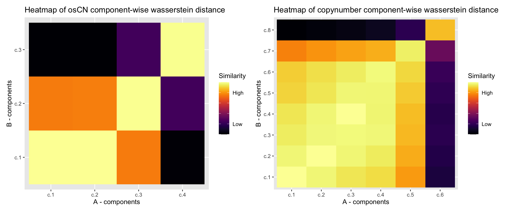
```

The earth-movers distance heatmap shows that the two lowest components from the example signature's oscillating CN-feature are both highly similar to the first component in the published signatures. The CN-feature 'copynumber' heatmap shows a typicaly trend of the lower components being much more similar to one another and then the distributions flatten and extend as they rise in value. Note that components A - c.6 and B - c.8 are less similar than we might expect. This is likely due to there being just 6 components in in the A set (example set), and so the value is pulled down.  


#### V.2 - Shaded line plots of mixture components

Individual mixture components for a signature can be visualized using shaded line plots.
In the case of the "segment size" copy-number feature this will be a series of Gaussians. The `MixtureModelPlots()` function from utanos can return plots for any or all of the components that compose each signature. Additionally, the specific components that are most prevalent for the signature indicated are shaded.  

Some examples.
  
```{r, eval=FALSE}
# Reorder the HGSOC signatures the same way as is done in the paper (keep things easy to compare)
sigs_hgsoc_df <- basis(sigs_hgsoc)
reord_britroc <- as.integer(c(2,6,5,4,7,3,1))
sigs_hgsoc_df <- sigs_hgsoc_df[,reord_britroc]

mixture_plots <- MixtureModelPlots(sigs_hgsoc_df, 
                                   cm_hgsoc, 
                                   sig_of_interest = 7)
mixture_plots$copynumber
```

```{r, out.width = '60%', echo = FALSE}
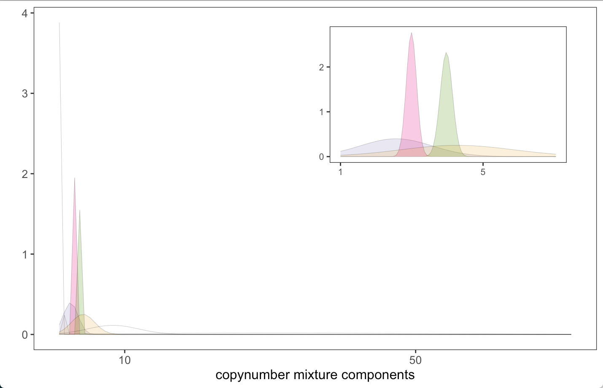
```

As briefly mentioned in section V.2, the CN-feature 'copynumber' shows a typical trend of lower components being much more similar to one another and then the distributions flatten and extend as they rise in value reflecting an increase in variance. This is easy to see in the shaded line plots.

#### V.3 - Alluvial flow plots of samples across signatures

To make an Alluvial-flow/Sankey plot 2 comparisons are needed.  

Signature exposures for each sample to each set of signatures:  
Britroc HGSOC samples -> Britroc HGSOC Sigs  
Britroc HGSOC samples -> Vancouver p53abn Endometrial Sigs  

This is result in two matrices of signature exposures per sample.

The utanos function `SEAlluvialPlot()` takes two matrices of signature exposures and creates an Alluvial plot using the easyalluvial R-package. Of course, the same samples must be in both matrices. If not already installed, install the easyalluvial package.

```{r, eval=FALSE}
library(easyalluvial)
# Pull exposures for the 91 highest quality samples out of the signatures object itself (the coefficients matrix)
expo_mat_hq <- NMF::scoef(sigs_hgsoc)
expo_mat_hq <- expo_mat_hq[reord_britroc,]
expo_mat_hq <- NormaliseMatrix(expo_mat_hq)
# Exposures were calculated for the 117-91 samples back in Section 3. 
expo_mat_mq <- sigexposures[reord_britroc,]
# Combine
expo_hgsoc <- cbind(expo_mat_hq, expo_mat_mq)

# Find exposures of HGSOC samples to p53abn EC signatures
expo_ec <- CallSignatureExposures(acn.obj,
                                  component_models = cm_hgsoc, 
                                  signatures = sigs_p53ec, 
                                  refgenome = 'hg19')

# Pass both matrices of signature exposures to the SEAlluvialPlot utanos function
alluvial_output <- SEAlluvialPlot(expo_hgsoc, expo_ec)
alluvial_output$plot
```

```{r, out.width = '60%', echo = FALSE}
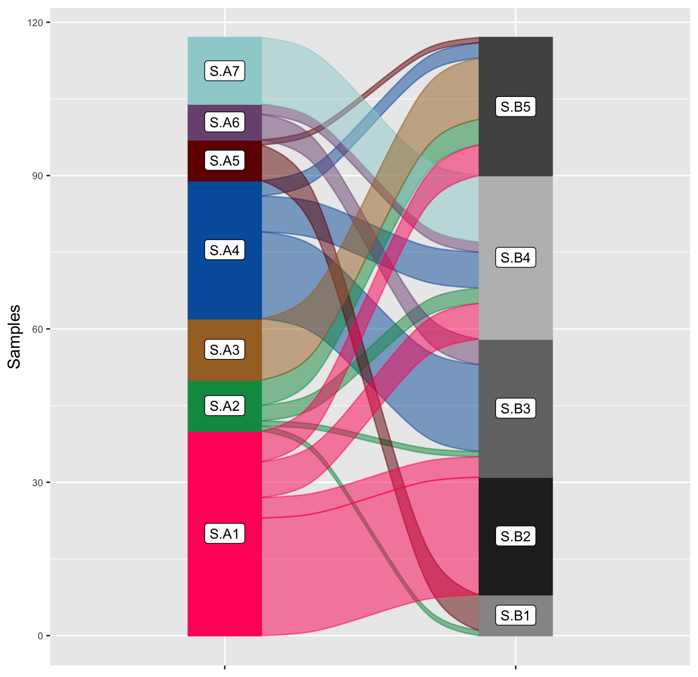
```

Notably, the alluvial plot highlights the likely similarity of signature 1 in HGSOC set and signature 2 in the p53abn EC set.
Many samples with a maximum exposure to one, also have a max. exposure to the other. The same goes for A4 and B3.  

Each of the past three subsections in combination with tests of significance can help the user in comparing and contrasting copy-number signature sets.

<br>

#### References
