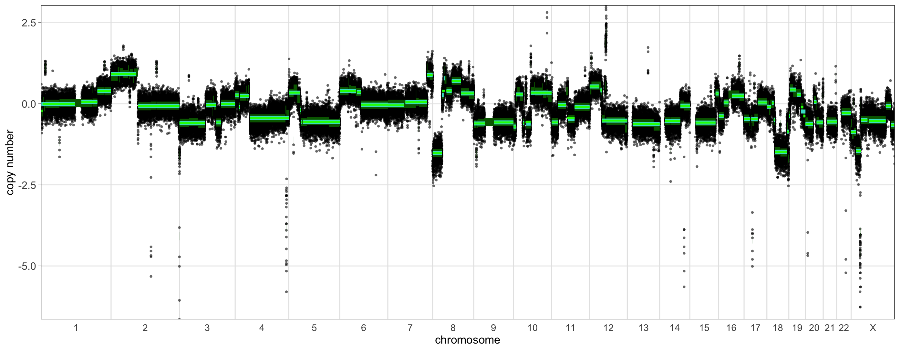

```{r, include = FALSE}
knitr::opts_chunk$set(
  collapse = TRUE,
  comment = "#>"
)
```

---

### I - Introduction & background

---

This vignette discusses the prediction of homologous recombination deficiency (HRD) from relative copy-number (rCN) data derived from shallow whole-genome sequencing (sWGS). Detecting HRD is of interest to researchers and clinicians, particularly in ovarian and breast cancer, as treatment of HRD cases with poly (ADP-ribose) polymerase inhibitors (PARPis) is associated with improved progression-free survival [@Davies2017; @Callens2023]. As HRD tumors are partially, or entirely, unable to repair double-strand breaks (DSBs) via homologous recombination, they rely on alternative pathways for DSB repair. This reliance is reflected in characteristic 'genomic scars' in HRD tumors, and various academic and commercial assays have attempted to use these scars, often in conjunction with mutations in key HR-related genes such as BRCA1/2, to identify HRD in patient tumors [@Davies2017; @Callens2023].

Many existing methods used to identify HRD status such as HRDetect [@Davies2017] or the commercial Myriad MyChoice assay require variant calling, necessitating deep whole-genome sequencing or targeted sequencing in conjunction with another method of CN assessment, such as sWGS or a SNP array. Given the significantly reduced cost of sWGS, it is desirable to predict HRD solely from CN data furnished by sWGS. In 2020 Eeckhoutte et al. devised shallowHRD [@Eeckhoutte2020], a tool for the prediction of HRD status from CN data derived from sWGS, which has since been validated in at least one follow-up study [@Guo2023]. An updated version of shallowHRD has since been published [@Callens2023], but the code is not publicly available.

In the interest of streamlining HRD prediction, we implemented version one of shallowHRD [@Eeckhoutte2020] in Utanos, with some changes to ease the ingestion of QDNAseq objects and cohort-wide HRD prediction; the core algorithm remains the same. In brief, large-genomic alterations (LGAs), defined as adjacent segments in the same arm that are greater than 10 Mb in size and separated by fewer than 3 Mb, are one example of a genomic scar that is indicative of HRD [@Callens2023]. ShallowHRD seeks to identify LGAs in an iterative fashion, composed of two passes through the segmented CN data. Because of noise that is inherent to the sampling process, which varies as a function of read depth, among other factors like GC-content, mappability, and artifacts derived from fixation, segmentation is necessarily imperfect. ShallowHRD therefore seeks to merge adjacent segments which differ in CN by less than a threshold in order to better identify LGAs. In the first pass, kernel density estimation (KDE) is used to find a local minimum in the segment-wise CN distance -- that is, the CN distance between adjacent segments. Adjacent segments with CN distance less that the identified threshold are merged and their segmented CN values are recalculated accordingly.  After merging segments in the first pass, a second estimate of the optimal merging threshold is determined in the same fashion, this time using the updated segmented CN values produced by the first pass. This provides a refined estimate of the merging threshold, which is then used to merge the original segments, yielding the final set of merged segments. Finally, the LGAs in the sample are counted, and the HRD status is determined; samples with 20 or more LGAs are considered HRD, with the remainder being non-HRD.

---

### II - Input data

---

As an example dataset we will again use the samples found in the *utanosmodellingdata* repository found [here](https://github.com/Huntsmanlab/utanosmodellingdata). If not already done, clone that repo to somewhere convenient such as a common 'repos' folder on your machine and read in the example data. It is human endometrial carcinoma sWGS data aligned to hg19. The associated publication [@Jamieson2024] was published in CCR and can be found [here](https://doi.org/10.1158/1078-0432.CCR-23-3689).

Download said data/clone the repo, and read in the relative copy-numbers:  
```{r setup, eval=FALSE}
> library(utanos)
> library(QDNAseq)
> library(ggplot2)
> rcn.obj <- readRDS("~/repos/utanosmodellingdata/sample_copynumber_data/sample_rcn_data.rds")
```

```{r, eval = FALSE}
> rcn.obj
QDNAseqCopyNumbers (storageMode: lockedEnvironment)
assayData: 103199 features, 10 samples 
  element names: copynumber, segmented 
protocolData: none
phenoData
  sampleNames: CC-CHM-1341 CC-CHM-1347 ... CC-HAM-0385 (10 total)
  varLabels: name total.reads ... loess.family (6 total)
  varMetadata: labelDescription
featureData
  featureNames: 1:1-30000 1:30001-60000 ... Y:59370001-59373566 (103199 total)
  fvarLabels: chromosome start ... comCNV.mask (11 total)
  fvarMetadata: labelDescription
experimentData: use 'experimentData(object)'
Annotation: 
```

---

### III - Extract data and run shallowHRD

---

We can run shallowHRD directly on the QDNAseq object we just read in, using the `RunShallowHRDFromQDNA()` function, or on a table of segments, using the `RunShallowHRD()` function. Since estimating the threshold used to merge segments requires 100,000 iterations by default, running a single sample can take a few minutes. In the interest of time, we will extract a single sample from the QDNAseq object and demonstrate running shallowHRD on a table of segments. To run it for all the samples in the object, we could just call `RunShallowHRDFromQDNA()` directly on the QDNAseq object, with most arguments remaining the same as those we'll provide to `RunShallowHRD()`.

Let's extract the bin-wise and segment-wise rCN data form the QDNAseq object using the `ExportBinsQDNAObj()`, and join them into a single table. This process is taken care of for us by `RunShallowHRDFromQDNA()` if running shallowHRD for all samples.

```{r, eval=FALSE}
> bin_df <- ExportBinsQDNAObj(object = rcn.obj, type = "copynumber", filter = TRUE) %>%
+     tidyr::pivot_longer(cols = !c("feature", "chromosome", "start", "end"), names_to = "sample", values_to = "ratio") %>%
+     dplyr::select(!feature)

> seg_df <- ExportBinsQDNAObj(object = rcn.obj, type = "segments", filter = TRUE) %>%
+     tidyr::pivot_longer(cols = !c("feature", "chromosome", "start", "end"), names_to = "sample", values_to = "ratio_median") %>%
+     dplyr::select(!feature)

> df_group <- dplyr::inner_join(x = bin_df, y = seg_df, by = dplyr::join_by(sample, chromosome, start, end)) %>%
+     dplyr::select(!end) %>%
+     dplyr::group_by(sample)

> df_list <- dplyr::group_split(df_group, .keep = FALSE)
> names(df_list) <- dplyr::group_keys(df_group)$sample
```

Below we can see the resulting dataframe for a single sample. Note that `ExportBinsQDNAObj()` does not log transform the rCN data, so the values are centered about 1, rather than 0. The 'ratio' column indicates the bin-wise rCN, and the 'ratio_median' column indicates the segment-wise rCN. If you wish to pass your own raw tables to `RunShallowHRD()`, from one of the many tools for generating rCN profiles, you should format the data in the same fashion, with the same column names.

```{r, eval=FALSE}
> head(df_list$`CC-CHM-1341`)
# A tibble: 6 × 4
  chromosome  start ratio ratio_median
  <chr>       <int> <dbl>        <dbl>
1 1          840001 1.11         0.941
2 1          870001 1.05         0.941
3 1          900001 1.02         0.941
4 1          930001 0.893        0.941
5 1          960001 1.17         0.941
6 1          990001 0.988        0.941
```

shallowHRD expects rCN data to be log-transformed, so when we call `RunShallowHRD()`, we need to indicate that the data should be log-transformed, by setting `log_transform = TRUE`. Since we know this sample is from a female, we will include the X-chromosome: `include_chr_X = TRUE`. Because the sampling process during threshold estimation relies on pseudo-random number generation, we have the option of specifying a seed, which will ensure repeated runs of the same sample will produce an identical result. We can do so with the `seed` parameter, but a value is specified by default, and it is not necessary to change it. We will leave the `num_simulations` to the default value of 100,000. We don't recommend reducing this value, as it leads to instability in the estimation of the segment merging threshold in our experience. By setting ` shrd_save_path = './'`, we will save a table summarizing the large segments detected, and the count of large segments for a range of sizes, to the current working directory. Lastly, we specify the sample name, which will be used to label our files and plots, `sample = 'CC-CHM-1341'`, and we indicate that we wish to generate a plot illustrating the segment merging process, `plot = TRUE`.

```{r, eval=FALSE}
> shrd_result <- RunShallowHRD(raw_ratios_file = as.data.frame(df_list$`CC-CHM-1341`), 
+               log_transform = TRUE,
+               include_chr_X = TRUE,
+               shrd_save_path = './',
+               sample = 'CC-CHM-1341',
+               plot = TRUE)
```

When you run the code in the block above, you'll observe that every thousandth iteration of the sampling process for threshold determination is printed out (omitted here).

---

### IV - Assess the results

---

Let's take a look at the results returned in `shrd_result`. 

```{r, eval=FALSE}
> shrd_result
$hrd_status
[1] FALSE

$n_lga
  Size_LGA Number_LGA
1        3         27
2        4         23
3        5         23
4        6         20
5        7         15
6        8         14
7        9         14
8       10         11
9       11         11

$lga
   index chr chr_arm     start       end ratio_median     size level WC
1     34   1     1.0    840001  32100000 -0.087733372 31260000     1  0
2      2   1     1.0  32100001  44520000  0.932817103 12420000     2  1
3      3   1     1.0  44520001 121350000  0.039840265 76830000     3  1
4      4   1     1.5 143760001 171090000  0.531069493 27330000     4  0
5      5   1     1.5 171090001 249210000  1.075190314 78120000     5  1
22    22   7     7.5  62460001  79560000 -0.024736678 17100000    22  0
23    23   7     7.5  79560001 159120000  0.358396262 79560000    23  1
25    25   8     8.5  47460001  67080000  0.002882509 19620000    25  0
26    26   8     8.5  67080001 146280000  0.611644543 79200000    26  1
31    31   9     9.5  94230001 119400000 -0.128156351 25170000    31  0
32    32   9     9.5 119400001 135480000  0.377956527 16080000    32  1
38    38  11    11.5  55050001  68220000 -0.015957574 13170000    38  0
39    39  11    11.5  68220001  79920000  0.641546029 11700000    39  1
40    40  11    11.5  79920001  91470000 -0.018878010 11550000    40  1
44    44  12    12.5  38460001  63780000  0.462575888 25320000    44  0
45    45  12    12.5  63780001  74400000  0.829443681 10620000    45  1
46    46  12    12.5  74400001 133830000  0.055195654 59430000    46  1
56    56  18    18.5  18540001  41190000  0.437227739 22650000    56  0
57    57  18    18.5  41190001  78000000 -0.150400989 36810000    57  1

$plot
```

We can see that a list is returned, stored in `shrd_result`. The first element, `hrd_status`, is a boolean that indicates whether this sample is predicted to be HRD or not; in this case we see that this sample predicted to be non-HRD. Next we see `n_lga`, a table that indicates the number of genomic alterations of a given size (in Mb) or greater. For example, we can see that after merging segments, this sample had 27 segments of size 3 Mb or greater, which includes 11 segments of 10 Mb or greater. Since a sample must have 20 or more segments of 10 Mb or greater with altered rCN for a positive prediction of HRD, we can see why this sample is non-HRD. The `lga` element is a table of all the segments greater than 10 Mb in size, including segments that are not considered LGAs under the precise criteria for LGAs, which is why we see more segments in this table than in the corresponding entry in the `n_lga` table. Recall that to be considered an LGA, a segment must be greater than 10 Mb, preceded by another segment greater than 10 Mb in the same chromosome arm, and the distance between those segments must be less than 3 Mb. The `WC` column marks LGA segments with a 1, and non-LGA segments with a 0. If you add up the number of 1s in the `WC` column, you will see that they sum to 11, as indicated in row 8 of the `n_lga` table. Finally, the `plot` element provides a plot that illustrates the segment merging process:

```{r, out.width = '100%', echo = FALSE}

```

In this plot we can see our usual rCN profile, log-transformed and centered about 0. The thick green bars indicate the original segmentation. To visualize the process of segment merging over two passes, the medium thickness aquamarine bars illustrate the segments after merging with the first threshold, and the thinnest bright green bars show the final segmentation, after merging using the threshold estimated during the second pass. We can see that many segments are merged in the first pass, with only a few undergoing additional merging or un-merging during the second pass, such as those near the middle of chromosome 7.

Let's take a quick look at a sample that is predicted to be borderline for HRD (15-19 LGAs). We can run shallowHRD for it in the same fashion as before.

```{r, eval=FALSE}
> shrd_result_borderline <- RunShallowHRD(raw_ratios_file = as.data.frame(df_list$`CC-HAM-0385`), 
+               log_transform = TRUE,
+               include_chr_X = TRUE,
+               shrd_save_path = './',
+               sample = 'CC-CHM-1341',
+               plot = TRUE)

> shrd_result_borderline
$hrd_status
[1] FALSE

$n_lga
  Size_LGA Number_LGA
1        3         29
2        4         27
3        5         27
4        6         21
5        7         20
6        8         19
7        9         17
8       10         15
9       11         14

$lga
   index chr chr_arm     start       end ratio_median     size level WC
3      3   1     1.5 143760001 200670000  0.051024003 56910000     3  0
4      4   1     1.5 200670001 249210000  0.387362541 48540000     4  1
8      8   3     3.5  93540001 130950000 -0.035786412 37410000     8  0
9      9   3     3.5 130950001 147720000 -0.575615328 16770000     9  1
10    10   3     3.5 147720001 197820000 -0.008682243 50100000    10  1
20    20   6     6.5  61980001  74970000  0.353323181 12990000    20  0
21    21   6     6.5  74970001 170910000 -0.029146346 95940000    21  1
23    23   7     7.5  62460001 139620000  0.048236186 77160000    23  0
24    24   7     7.5 139620001 159120000  0.887525271 19500000    24  1
25    25   8     8.0    180001  33360000 -1.514573173 33180000    25  0
26    26   8     8.0  33360001  43380000  0.399444565 10020000    26  1
27    27   8     8.5  47460001  67710000  0.403813062 20250000    27  0
28    28   8     8.5  67710001 100590000  0.698218410 32880000    28  1
29    29   8     8.5 100590001 146280000  0.318461465 45690000    29  1
35    35  10    10.5  42870001  61320000 -0.564904848 18450000    35  0
36    36  10    10.5  61320001 135420000  0.340277405 74100000    36  1
37    37  11    11.0    210001  22860000 -0.575615328 22650000    37  0
38    38  11    11.0  22860001  51540000 -0.040971781 28680000    38  1
39    39  11    11.5  55050001  81630000 -0.440263476 26580000    39  0
40    40  11    11.5  81630001 134940000 -0.101598140 53310000    40  1
45    45  14    14.5  19440001  73740000 -0.530114400 54300000    45  0
46    46  14    14.5  73740001 107280000 -0.060397280 33540000    46  1
47    47  15    15.5  20160001  91200000 -0.582079992 71040000    47  0
48    48  15    15.5  91200001 102390000  0.314406391 11190000    48  1
49    49  16    16.0     90001  17610000 -0.384583703 17520000    49  0
50    50  16    16.0  17610001  35130000  0.039840265 17520000    50  1
53    53  17    17.5  25380001  48660000 -0.476940288 23280000    53  0
54    54  17    17.5  48660001  81090000  0.037030731 32430000    54  1
70    70  23    23.0    300001  16980000 -0.875671865 16680000    70  0
71    71  23    23.0  16980001  35760000 -1.457989644 18780000    71  1
72    72  23    23.0  35760001  58080000 -0.498178735 22320000    72  1
73    73  23    23.5  63780001 122790000 -0.529072743 59010000    73  0
74    74  23    23.5 122790001 141840000 -0.064918266 19050000    74  1
75    75  23    23.5 141840001 155220000 -0.655171503 13380000    75  1

$plot
```

In this sample, we find 15 LGAs, which are visually reflected in the plot:

```{r, out.width = '100%', echo = FALSE}

```

#### References
