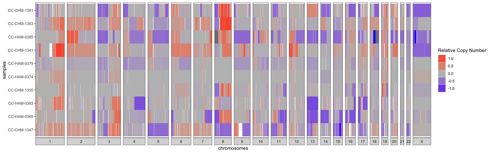

```{r, include = FALSE}
knitr::opts_chunk$set(
  collapse = TRUE,
  comment = "#>"
)
```

***

## I - Introduction

Broadly, this vignette seeks to demonstrate how a user could answer the following two questions using utanos:

  * In my dataset, where do copy-number gains and losses co-occur? 
  * To what extent do these aberrations co-occur across individual samples?

utanos provides two options by which to find answers to these questions. 1 - using plots/diagrams to visualize the differences, or 2 - by manually examining informative, well-formatted tables.

<br>
**Exclusions:** This vignette does not cover data filtration in detail. It does not go over filtration or setting masks in the QDNAseq object. The vignette titled "Sample Filtering and Quality Evaluation" covers the filtration and QC steps. 
<br><br>

As an example dataset we will again use the samples found in the *utanosmodellingdata* repository found [here](https://github.com/Huntsmanlab/utanosmodellingdata). If not already done, clone that repo to somewhere convenient such as a common 'repos' folder on your machine and read in the sample data. It is human endometrial carcinoma sWGS data aligned to hg19.

```{r setup, eval = FALSE}
> library(utanos)
> library(QDNAseq)
> library(magrittr)
> rcn.obj <- readRDS("~/repos/utanosmodellingdata/sample_copynumber_data/sample_rcn_data.rds")
```

```{r, eval = FALSE}
> rcn.obj
QDNAseqCopyNumbers (storageMode: lockedEnvironment)
assayData: 103199 features, 10 samples 
  element names: copynumber, segmented 
protocolData: none
phenoData
  sampleNames: CC-CHM-1341 CC-CHM-1347 ... CC-HAM-0385 (10 total)
  varLabels: name total.reads ... loess.family (6 total)
  varMetadata: labelDescription
featureData
  featureNames: 1:1-30000 1:30001-60000 ... Y:59370001-59373566 (103199 total)
  fvarLabels: chromosome start ... comCNV.mask (11 total)
  fvarMetadata: labelDescription
experimentData: use 'experimentData(object)'
Annotation: 

```

## II - Call gains and losses on relative copy-number data

The callBins function from the QDNAseq package can be run on segmented copy number data to determine chromosomal aberrations. This function adds gain/loss probability slots to the input S4 object. Under the hood it makes use of the CGHcall R package.
Please refer to those packages for further algorithmic details.

Here is an example using our sample data.

```{r, eval = FALSE}
> rcn.obj <- FilterCNs(cnobj = rcn.obj, genome = "hg19", maskcomCNVs = TRUE)
> rcn.obj <- callBins(rcn.obj)
```

Notes:  

* Depending on dataset size the `callBins()` function can take a while

## III - Plotting

### III.1 - CN-Summary Plot

The CGHbase R-package provides an excellent plot showing the gain and loss probability across multiple samples. Utanos contains a modified version of this plotting function and it can be generated like so...

```{r, eval = FALSE}
> SummaryCNPlot(rcn.obj, maskaberr = 0.1, maskprob = 0.2)
```

```{r, out.width = '100%', echo = FALSE}
knitr::include_graphics("../images/cndiversity_vignette_01.png")
```

Notes:  

  * The 'maskaberr' parameter - Default Value: 0.1. This parameter filters out all gains and losses across samples where the CN-change (the aberration itself) lies between this value and zero.
  * The 'maskprob' parameter - Default Value: 0.2. This parameter filters out all the gain/loss probabilities below this value. The callBins function assigns a probability of gain/loss to each bin of each sample. This is especially useful when analyzing noisy samples.

These parameters are quite similar but both are available because it allows users to mask low probability gain/loss regions without taking into account how large the gain/loss was.

### III.2 - Relative-CN Diversity Plot

Alternatively, the relative copy-number changes can be visualized sample-by-sample as a heatmap with red signifying a relative gain and blue a loss. For just a few samples, row-wise clustering doesn't have too much of an effect on the plot, but for larger cohorts setting the `cluster` parameter to `TRUE` can really help to highlight trends in the data. This is a simple hierarchical clustering. 

```{r, eval = FALSE}
> rcn.plot <- RCNDiversityPlot(rcn.obj, Xchr = TRUE, cluster = TRUE)
> rcn.plot
```

```{r, out.width = '100%', echo = FALSE}

```


## IV - Table Output

The `MakeSummaryTable()` function can be used to generate tables of the copy-number gains and losses.  
If desired, the user can also generate a second table containing just the peaks by setting `find_peaks = TRUE`. The threshold parameters outlined in the below code section will apply to both the generated summary CN aberrations table and the peaks table. Peaks in the CN probability data are identified using the `gsignal::findpeaks` function. Peaks are simply defined as local maxima. This function itself is a port-over of its namesake function in the Octave package 'signal'.  
The `MakeSummaryTable()` function returns a list with either 1 or 2 tables (type: tibble).  

These tables can be easily saved as csvs, tsvs, or in your favourite tabular format for perusal in a different user-friendly application such as excel.

```{r, eval = FALSE}
> library(gsignal)

# Probability of gain or loss threshold - i.e. declare the minimum mean probability of loss or gain across samples
# Expl. For region Chr1:2850001-2865000, and probabilities of loss for 10 samples of:
# 0.814 0 0 0 0 0.125 0.975 0 0 0
# The mean probability of loss would be 0.1914
> prob_loss <- 0.2
> prob_gain <- 0.2

# Log space mean relative copy number thresholds
# To keep things consistent with the plot from the last section, lets use 0.1
> low_threshold <- -0.1
> high_threshold <- 0.1

# Presence threshold - i.e. In what minimum proportion of samples does the gain or loss need to be present?
> proportion_threshold <- 0.2

# Run command
> output <- MakeSummaryTable(rcn.obj, 
                           low_threshold, high_threshold, 
                           prob_loss, prob_gain, 
                           proportion_threshold,
                           find_peaks = TRUE)
> output$summary_table %>% head(5)
# A tibble: 5 × 14
  chromosome   start    end mean_copy_number gain_probability loss_probability gain_count loss_count
  <chr>        <int>  <int>            <dbl>            <dbl>            <dbl>      <dbl>      <dbl>
1 1           840001 1.02e6            0.150            0.301           0.0076          3          0
2 1          1020001 1.95e6            0.101            0.213           0.0076          3          0
3 1          1950001 2.16e6            0.146            0.213           0.0076          3          0
4 1          2160001 2.22e6            0.116            0.211           0.054           3          1
5 1          8880001 9.06e6            0.157            0.247           0.006           5          0
# ℹ 6 more variables: gain_samples <chr>, loss_samples <chr>, bin_count <int>,
#   sum_of_bin_lengths <dbl>, coordinates <chr>, features_in_region <chr>
```


