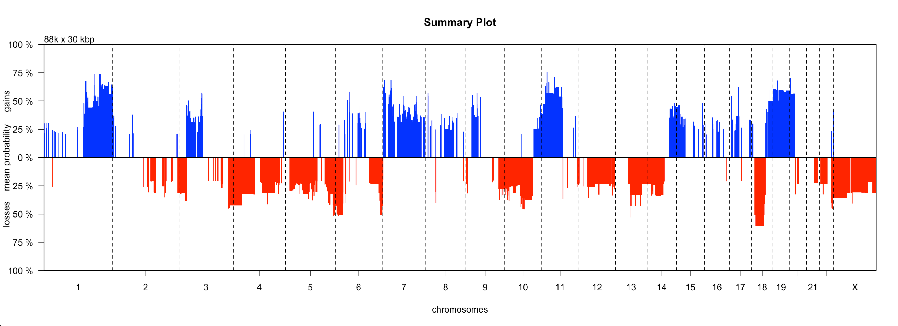

Investigating Aggregate CN Changes
================
Compiled: June 20, 2023

------------------------------------------------------------------------

### I - Introduction

Broadly, this vignette seeks to demonstrate how a user could answer the
following two questions using utanos:

-   In my dataset, where do copy-number gains and losses co-occur?
-   To what extent do these aberrations co-occur across individual
    samples?

utanos provides two options by which to find answers to these questions.
1 - using plots/diagrams to visualize the differences, or 2 - by
manually examining informative, well-formatted tables.

**Exclusions:** This vignette does not cover data filtration. It assumes
data has already been filtered of low-interest and/or low-mappability
regions. The vignette assumes that the remaining bins are those intended
for analysis. Note: The QDNAseq object provides a slot (use) that serves
the purpose of a mask over the chromosomal bins. This slot
`xxxx@featureData@data[["use"]]` may be an interesting alternative for
users who do not wish to drop bins entirely.

First, load several relative copynumber profiles (QDNAseq S4 formatted)
into your environment.  
Here is some sample data available to play with on github:
<https://github.com/Huntsmanlab/utanosmodellingdata/tree/main/sample_copynumber_data>  
This toy dataset will be used throughout the vignette.

``` r
> library(QDNAseq)
> library(utanos)
> sample_cn_data <- readRDS(file = '~/repositories/utanosmodellingdata/sample_copynumber_data/sample_cn_data.rds')
```

``` r
> sample_cn_data
QDNAseqCopyNumbers (storageMode: lockedEnvironment)
assayData: 86398 features, 10 samples 
  element names: calls, copynumber, probamp, probdloss, probgain, probloss, probnorm, segmented 
protocolData: none
phenoData
  sampleNames: CC-CHM-1341 CC-CHM-1347 ... CC-HAM-0385 (10 total)
  varLabels: name total.reads expected.variance
  varMetadata: labelDescription
featureData
  featureNames: 1:2850001-2880000 1:2880001-2910000 ... X:155250001-155270560 (86398 total)
  fvarLabels: chromosome start end use
  fvarMetadata: labelDescription
experimentData: use 'experimentData(object)'
Annotation: 
```

### II - Call gains and losses on relative copy-number data

The callBins function from the QDNAseq package can be run on segmented
copy number data to determine chromosomal aberrations. This function
adds gain/loss probability slots to the input S4 object. Under the hood
it makes use of the CGHcall R package. Please refer to those packages
for further algorithmic details.

Here is an example using our sample data.

``` r
> gl_sample_cn_data <- callBins(sample_cn_data)
```

Notes:

-   Depending on dataset size the `callBins()` function can take a while
    -   This calling step is unnecessary if the data object being used
        already contains slots titled ‘probgain’ or ‘proamp’ - perhaps
        check first
-   If it does, this means that the gain/loss probabilities have already
    been called, and you can proceed directly onto section III

### III - Plotting

The CGHbase R-package provides an excellent plot showing the gain and
loss probability across multiple samples. utanos contains a slightly
modified version of this plotting function and it can be generated like
so…

Notes:

-   The ‘markaberr’ parameter - Default Value: 0.1. Parameter removes
    all gains/loss probabilities bins where the aberation lies between
    this value and zero.
-   The ‘maskprob’ parameter - Default Value: 0.2. Parameter removes all
    the gains/loss probabilities below this value. This is especially
    useful when analyzing noisy samples.

``` r
> SummaryCNPlot(gl_sample_cn_data, maskaberr = 0.1, maskprob = 0.2)
```



### IV - Table Output

The `MakeSummaryTable()` function can be used to generate tables of the
copy-number gains and losses. If desired, the user can also generate a
second table containing just the peaks by setting `find_peaks = TRUE`.
The threshold parameters outlined in the below code section will apply
to both the generated table and the peaks table. Peaks in the CN
probability data are identified using the gsignal::findpeaks function.
The `MakeSummaryTable()` function returns a list with either 1 or 2
tables (type: tible). These tables can be easily saved as csvs, tsvs, or
in your favourite tabular format for perusal in a differnt user-friendly
application such as excel.

``` r
> library(gsignal)

# Probability of gain or loss threshold - i.e. declare the minimum mean probability of loss or gain across samples
# Expl. For region Chr1:2850001-2865000, and probabilities of loss for 10 samples of:
# 0.814 0 0 0 0 0.125 0.975 0 0 0
# The mean probability of loss would be 0.1914
> prob_loss <- 0.2
> prob_gain <- 0.2

# Log space mean relative copy number thresholds
# To keep things consistent with the plot from the last section, lets use 0.1
> low_threshold <- -0.1
> high_threshold <- 0.1

# Presence threshold - i.e. In what minimum proportion of samples does the gain or loss need to be present?
> proportion_threshold <- 0.2

# Run command
> output <- MakeSummaryTable(gl_sample_cn_data, 
                           low_threshold, high_threshold, 
                           prob_loss, prob_gain, 
                           proportion_threshold,
                           find_peaks = TRUE)
> output$summary_table
# A tibble: 1,565 × 14
   chromosome    start      end mean_copy_number gain_probability loss_probability gain_count loss_count gain_samples                                    loss_…¹ bin_c…² sum_o…³ coord…⁴ featu…⁵
   <chr>         <int>    <int>            <dbl>            <dbl>            <dbl>      <dbl>      <dbl> <chr>                                           <chr>     <int>   <dbl> <chr>   <chr>  
 1 1            840001  1020000            0.150            0.301           0.0076          3          0 CC-CHM-1347,CC-CHM-1361,CC-HAM-0383             ""            6  180000 chr1:8… RP11-5…
 2 1           1020001  1950000            0.101            0.213           0.0076          3          0 CC-CHM-1347,CC-CHM-1361,CC-HAM-0383             ""           24  720000 chr1:1… C1orf1…
 3 1           1950001  2160000            0.146            0.213           0.0076          3          0 CC-CHM-1347,CC-CHM-1361,CC-HAM-0383             ""            7  210000 chr1:1… GABRD,…
 4 1           2160001  2220000            0.116            0.211           0.054           3          1 CC-CHM-1347,CC-CHM-1361,CC-HAM-0383             "CC-HA…       2   60000 chr1:2… SKI    
 5 1           8880001  9060000            0.157            0.247           0.006           5          0 CC-CHM-1347,CC-CHM-1361,CC-HAM-0369,CC-HAM-037… ""            6  180000 chr1:8… RP11-1…
 6 1           9600001 10230000            0.139            0.257           0.0046          6          0 CC-CHM-1347,CC-CHM-1353,CC-CHM-1361,CC-HAM-036… ""           21  630000 chr1:9… SLC25A…
 7 1          10620001 10770000            0.119            0.225           0.0077          5          1 CC-CHM-1347,CC-CHM-1361,CC-HAM-0369,CC-HAM-037… "CC-CH…       5  150000 chr1:1… PEX14,…
 8 1          10950001 11070000            0.177            0.305           0.0126          4          2 CC-CHM-1347,CC-HAM-0369,CC-HAM-0374,CC-HAM-0383 "CC-CH…       4  120000 chr1:1… HSPE1P…
 9 1          15420001 15630000            0.148            0.294           0.107           3          2 CC-CHM-1347,CC-HAM-0383,CC-HAM-0385             "CC-CH…       7  210000 chr1:1… KAZN,T…
10 1          15960001 16080000            0.155            0.304           0.107           3          2 CC-CHM-1347,CC-HAM-0383,CC-HAM-0385             "CC-CH…       4  120000 chr1:1… DDI2,D…
# … with 1,555 more rows, and abbreviated variable names ¹​loss_samples, ²​bin_count, ³​sum_of_bin_lengths, ⁴​coordinates, ⁵​features_in_region
# ℹ Use `print(n = ...)` to see more rows
```
