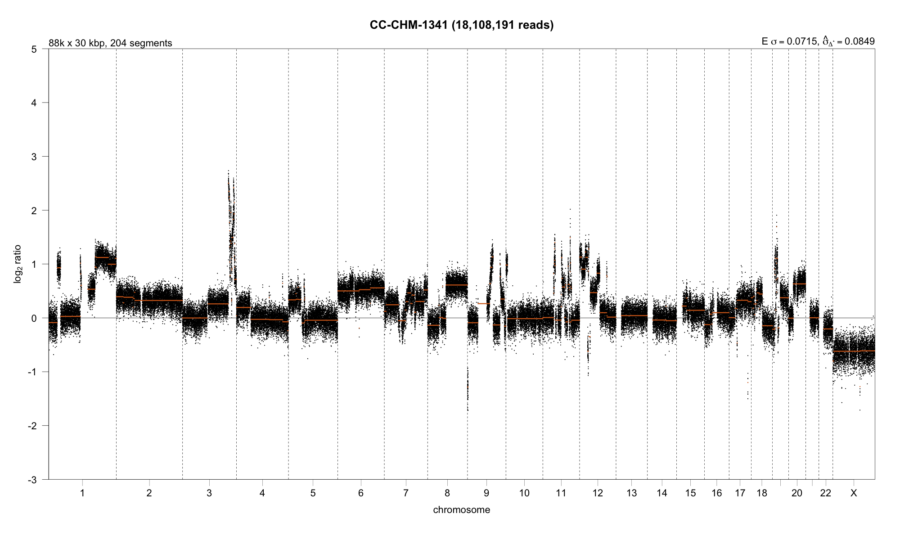

CN Sigs Utils Package Vignette: Evaluating the Sample Quality of the
Copy Number Calls
================

The CN-signature calling pipeline involves copy-number calling at two
stages: relative copy-calling (via tools such as `QDNASeq` and
`WiseCondorX`) from which absolute copy numbers can be inferred through
`rascal`. Naturally, the accuracy of the inferences that can be made
from the signatures calls downstream depend heavily on the accuracy of
the relative and absolute copy number calls inferred. The workflow used
by `rascal` to evaluate copy number calls relies on the manual curation
of samples. This is large;y done by manually inspecting the segment
copy-number plots and density plots produced by `rascal` in their R
Shiny app. The `rascal` Shiny app can be visualized using the following
command:

``` r
rascal::start_shiny_app()
```

However, it is an extensive project to manually evaluate the quality of
thousands of samples by hand. Additionally, there is no established
workflow based on empirical metrics to evaluate the quality of these
copy number calls. This is the niche that the CN-Sigs Utils package aims
to fill. An outline of a workflow that could be followed to evaluate the
sample quality of the copy number calls of `rascal` at the absolute copy
number stage is described in this vignette. This workflow will include
the implementation of functions to output metrics, which hopefully can
detect aberrant copy-number calls and greatly reduce the number of
samples that need to be manually curated.

The metrics and functions to be implemented in the package are described
below:

## The copy-number profile abnormality score penalty

This is a metric to distinguish abnormal from healthy copy number
profiles. The score quantifies the deviation of segments from the normal
diploid state at the sample-level. The copy-number profile abnormality
score can be expressed as follows:

}{n}")

Here,

represents the
-score
of the segment
.

represents the length of the segment and

represents the number of segments. The average segment length can be
represented as follows:


This term functions as a penalty term for sample quality, as short
segments are generally observed in bad quality or truly highly aberrant
samples. Thus, calculating this penalty in addition to other metrics may
be very informative of the copy number calling in a sample.

## Median segment variance

The segment variance would be calculated as the sample variance per
segment, i.e the variance between the

ratios in each segment. The observed median segment variance, a
sample-wise measure for noise, which is defined as the median of a set
of variances, where each variance corresponds to the variance of a
segment can then be calculated.

The key idea for evaluating sample quality here would be considering
both these metrics as a combination. To work through the intuition,
consider the copy number profiles of the following two samples.

### Sample 1: Good quality copy-number profile



### Sample 2: Poor quality copy number profile


The key aspects that differ between the two profiles are: the number of
segments, the length of segments, and the variance within each segment
of the

ratios, i.e we see the copy number ratios more tightly clustered around
the orange line for sample 1 compared to sample 2.

Thus, a workflow that could be followed is as such: all the samples with
a high number of segments can be flagged first. This can be done through
a simple outlier criteria such as Tukey’s IQR rule, or a value we define
by empirically testing some samples. Then the values with the highest
median segment variances in this subset (flagged through similar
criteria) will likely be considered to be outliers. Naturally this could
also be built into a classifier, which would be trained on our test set,
with the features being the segment sizes, median segment variances, the
Lillefor normality statistic, read length, coverage etc. Thus functions
that the package would offer as part of a sample quality evaluation
workflow are the following:

`evaluate_sample_quality` - A function that takes in the rascal MAD/VAF
optimal solutions as the input and outputs a data-frame with the median
segment variance and the average segment length/classifications of
quality. Additional statistics may also help for better-quality
filtering, such as the median Lillefor normality statistic. This
function could also output a line plot of a metric such as the product
of the average segment length and median segment variance.

`filter_quality` - A function that takes in the rascal MAD/VAF optimal
solutions as the input and outputs a dataframe with the filtered
“good-quality samples”. It additionally outputs the “outlier” samples
identified.

`plot_sample_quality` - A function that takes in the rascal MAD/VAF
optimal solutions and returns a facetted plot of 3 randomly selected
outliers and 3 randomly selected “high-quality samples”. This is a quick
summary alternative to glancing at all the copy-number profiles
individually.
