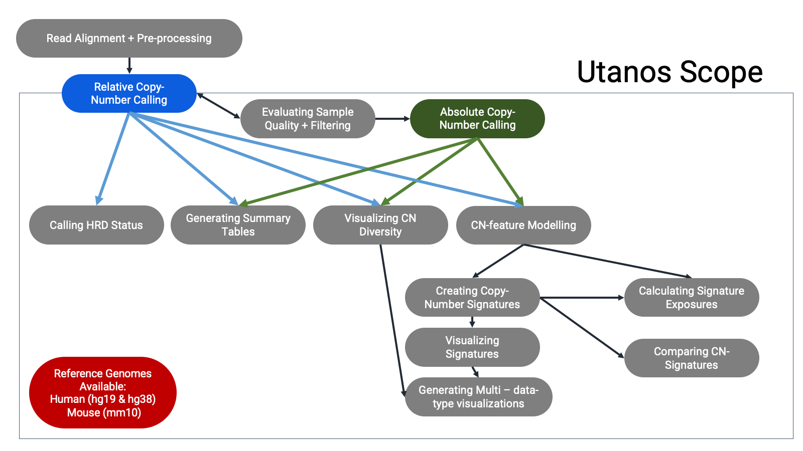
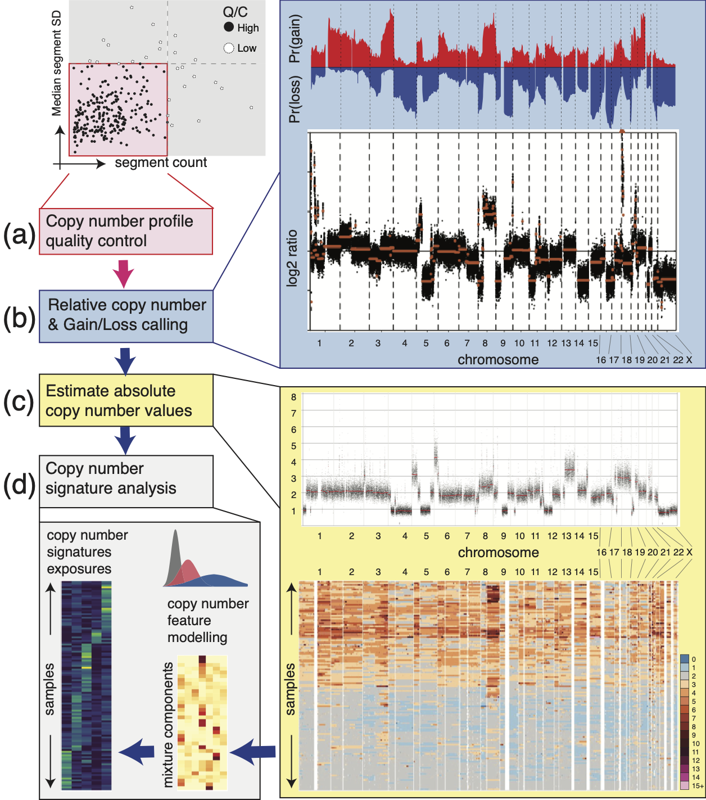

```{r, include = FALSE}
knitr::opts_chunk$set(
  collapse = TRUE,
  comment = "#>"
)
```

Shallow whole genome sequencing (sWGS) can be used to detect copy number (CN) aberrations, detect CN-Signatures (1), detect Homologous Recombination Deficiency (HRD) (2), and even create CN-Signatures (1). This is a popular sequencing type used for neo-natal diagnostics and studying cancer. One of the major benefits is the reduced cost when compared with Whole Genome Sequencing. With just 15 million reads or so usually targeted this assay costs a fraction of Whole Genome Sequencing.

Even so, should biological insights be desired beyond relative CN calling, comprehensive downstream analysis is needed. With this need in mind, we developed a general-purpose R-package for analysis workflows after relative copy-number calling - UTANOS, short for UTilities for the ANalysis Of Shallow WGS. Utanos provides data-driven quality control routines, absolute CN scaling, cross-cohort CN diversity profiling, CN feature extraction/factorization and annotation, and Homologous Recombination Deficiency (HRD) status prediction.

Package Overview:  

```{r, echo = FALSE}

```

<br>

In example use-cases, Utanos has been applied in multiple cancer genome studies, including two subtypes of endometrial carcinoma and High-Grade Serous Ovarian Cancer, to extract cancer- and individual-specific CN signatures and their activities genome-wide. Across cancer types/subtypes, Utanos indentified comparable CN signature sets and highlighted both ubiquitous and unique genomic features and locations. we've tested Utanos on down-sampled deep WGS (PCAWG), thus simulating sWGS data using a well-characterized cohort, and confirmed that Utanos effectively captured CN signatures manifested in the cohort. Finally, Utanos scales well to cohort-level analysis with hundreds of concurrent samples comfortably operable on a laptop.

Workflow Example:  

```{r, echo = FALSE}

```

<br>

## Sample Pre-processing

The utanos R-package focuses on downstream analysis, but this is just the later half of the analysis picture. To serve the first bit we've built a Nextflow workflow to serve as a pre-processing pipeline for sWGS data that can be the first step before using utanos.  

[Github Repository for sWGS Nextflow Workflow](https://github.com/Huntsmanlab/swgs-processing-pipeline)

The decision to use Nextflow + Singularity was intentional - this strategy improves inter-operability and modularity. This workflow can be run on cloud resources, local cluster-compute nodes, or larger local machines built to handle heavy processing. Any compute resources with Singularity and Nextflow installations can run this pipeline.

The output from the Singularity pipeline can be fed directly into utanos with multiple relative copy-number calling options available.

